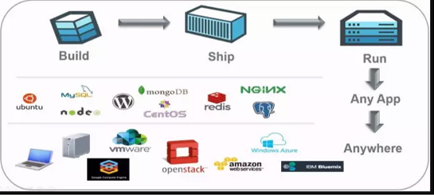
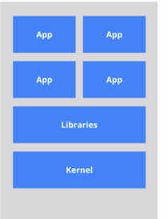
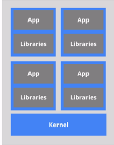

# Docker学习笔记

## 	Docker简介

### 	   是什么

	   ### docker理念

​	docker是基于Go语言实现的云开源项目

docker的主要目标是build ship and run any app anywhere  也就是通过对应用组件的封装 分发 部署 运行等生命周期的管理 使用户的app（可以是一个web应用或者数据库应用等）以及运行环境能够做到 一次封装 到处运行

Linux容器技术的出现就解决了一个这样的问题 而docker就是在它的基础上发展而来的 江永运行在docker容器上面 而docker容器在任何操作系统上都是一致的 这就实现了跨平台 跨服务器 至于要一次配置好环境 换到别额及其上就可以一键部署好  大大简化了操作

一句话 docker解决了运行环境和配置问题软件容器 方便做持续集成病有助于真题发的容器虚拟化技术

能干嘛：之前的虚拟机技术：

​		虚拟机是一种带环境安装的解决方案

​		他可以在一种操作系统里面运行另一种操作系统 比如windows系统里面运行linux凶 引用程序对此毫无感知 因为虚拟机看上去跟真实系统一模一样 而对底层系统来说虚拟机就是一个普通的文件  不需要了就删除  对其他部分毫无影响 这类虚拟机完美的运行了另一套系统 能够使应用系统 操作系统 和硬件三种之间的逻辑不变

虚拟机缺点:

​	占用资源多  冗余步骤多 启动慢

### 容器虚拟化技术

由于钱满虚拟机存在这些缺点 linux发展出了另一种虚拟化技术Linux容器(Linxu Containers 缩写为LXC)

**linux容器不是模拟一个完整的操作系统** 而是对进程进行隔离 有了容器  就可以将软件运行所需要的所有资源打包到一个隔离的容器中 容器与虚拟机不同 只需要软件工作所需的资源库和设置 系统因此变得高效轻量 病保证部署在任何环境中的软件都能始终如一的运行

比较了Docker和传统虚拟化方式的不同之处：

​	传统虚拟机技术是虚拟出了一套硬件后 在其上运行一个完整的操作系统 在该系统上再运行所需要的进程

​	而容器内的应用进程直接运行于宿主机的内核 **容器内没有自己的内核 而且也没有进行硬件虚拟** 因此容器要比传统虚拟机更为轻便

​	每个容器之间互相隔离 每个容器有自己的文件系统 容器之间进程不会互相影响 能区分计算资源

​	Dev/Ops

​		

​	docker三要素：

​		仓库

​		镜像		

​		容器

