# ElasticSearch


## 1 什么是ElasticSearch

​	基于Apache Luncene构建的开源搜索引擎

​	采用java编写 提供简单易用的ResufluAPI

​	轻松的横向扩展  可支持PB级别的结构化或非结构化数据处理

## 2 可用应用场景

​	海量数据分析引擎

​	站内搜索引擎

​	数据仓库

## 3 一线公司应用场景

​	英国卫报 --实时分析公众对文中的回应

​	维基百科 github-站内实时搜索

​	百度-实时日志监控平台

​	google  alibaba jd

## ES安装

参考

[es安装](https://satan12345.github.io/2019/01/21/es%E5%AE%89%E8%A3%85/)


../elasticsearch -d  后台启动es

## kibana安装


下载 kibana

解压 tar -zxvf kibana-5.6.9-linux-x86_64.tar.gz

ln -s kibana-5.6.9-linux-x86_64 kba

cd kba/config

修改配置文件


修改server.host为当前服务器的地址

修改elasticsearch.url为es实例的地址


./kibana &  后台启动kibaba

./elasticsearch -d

./kibaba &

### 集群配置 

主节点的配置文件中增加

要保证所有的节点的集群名称都保持一致

即：cluster.name: my-application

node.master: true

从节点的配置中要增加 发现主节点的的实例地址

discovery.zen.ping.unicast.hosts: ["192.168.119.158"]


## 基础概念

###集群和节点

一个集群是由一个或者多个es的节点组成


### 索引

索引是含有相同属性的文档集合

### 类型

索引可有定义一个或者多个类型 文档必须属于一个类型

### 文档

文档是可以被索引的基本数据单位

### 分片

每个索引都有多个分片 每个分片是一个lencene索引

### 备份

拷贝一份分片就是完成了分片的备份

默认5分分片 1个备份

分片只能在创建索引的时候确定 备份是可以动态修改的

## 基本用法

restful api

http://ip:port/索引/类型/文档id

//创建一个索引

```json

PUT /myindex
{
  "settings": {
    "number_of_shards": 5,
    "number_of_replicas": 1
  },
  "mappings": {
    "person":{
      "properties": {
        "name":{
          "type": "text"
        },
        "country":{
          "type": "keyword"
        },
        "age":{
          "type": "integer"
        },
        "date":{
          "type": "date",
          "format": "yyyy-MM-dd"
        }
      }
    }    
  }
}
```

### 数据插入

​	指定文档id插入

​	自动产生文档id插入

创建文档 指定id

```json
put myindex/person/1
{
  "name":"kakaxi",
  "age":18,
  "country":"muye",
  "date":"1989-08-03"
}

响应
{
  "_index": "myindex",
  "_type": "person",
  "_id": "1",
  "_version": 1,
  "result": "created",
  "_shards": {
    "total": 2,
    "successful": 2,
    "failed": 0
  },
  "created": true
}
```

创建文档 不指定id

```json
post /myindex/person
{
  "name":"mingren",
  "age":6,
  "country":"muye",
  "date":"1999-08-03"
}
```

### 修改文档数据

```json

PoST myindex/person/1/_update
{
  "doc":{
    "name":"万花筒卡卡西"
  }
}
响应
{
  "_index": "myindex",
  "_type": "person",
  "_id": "1",
  "_version": 2,
  "result": "updated",
  "_shards": {
    "total": 2,
    "successful": 2,
    "failed": 0
  }
}
```

```json
#脚本更新
POST myindex/person/1/_update
{
  "script": {
    "lang": "painless",
    "source": "ctx._source.age+=10"
  }
}

```

### 删除

​	删除文档

```json
DELETE myindex/person/1
响应：
{
  "found": true,
  "_index": "myindex",
  "_type": "person",
  "_id": "1",
  "_version": 5,
  "result": "deleted",
  "_shards": {
    "total": 2,
    "successful": 2,
    "failed": 0
  }
}
```

​	删除索引

```json
DELETE myindex 
响应
{
  "acknowledged": true
}
```

### 查询

数据准备

```json
//创建book索引
PUT /book
{
 "settings": {
   "number_of_shards": 5,
   "number_of_replicas": 1
 } ,
 "mappings": {
   "novel":{
     "properties": {
       "world_count":{
         "type": "integer"
       },
       "author":{
         "type": "keyword"
       },
       "title":{
         "type": "text"
       },
       "publish_date":{
         "type": "date",
         "format": "yyyy-MM-dd"
       }
     }
   }
 }
}
PUT /book/novel/5
{
  "author":"王五",
  "title":"菜谱",
  "world_count":5000,
  "publish_date":"2012-10-01"
}
PUT /book/novel/8
{
  "author":"瓦力",
  "title":"ElasticSearch入门",
  "world_count":3000,
  "publish_date":"2017-08-20"
}
PUT /book/novel/9
{
  "author":"很胖的瓦力",
  "title":"ElasticSearch精通",
  "world_count":3000,
  "publish_date":"2017-08-05"
}
PUT /book/novel/10
{
  "author":"牛魔王",
  "title":"芭蕉扇",
  "world_count":1000,
  "publish_date":"2000-10-01"
}
PUT /book/novel/2
{
  "author":"李三",
  "title":"Java入门",
  "world_count":2000,
  "publish_date":"2010-10-01"
}
PUT /book/novel/4
{
  "author":"李四",
  "title":"ElasticSearch大法好",
  "world_count":1000,
  "publish_date":"2017-08-01"
}
PUT /book/novel/6
{
  "author":"赵六",
  "title":"剑谱",
  "world_count":10000,
  "publish_date":"1997-01-01"
}
PUT /book/novel/1
{
  "author":"张三",
  "title":"移魂大法",
    "world_count":1000,
  "publish_date":"2000-01-01"
}
PUT /book/novel/7
{
  "author":"张三丰",
  "title":"太极拳",
  "world_count":1000,
  "publish_date":"1997-01-01"
}
PUT /book/novel/3
{
  "author":"张四",
  "title":"Python入门",
  "world_count":2000,
  "publish_date":"2005-10-01"
}
PUT /book/novel/11
{
  "author":"孙悟空",
  "title":"七十二变",
  "world_count":1000,
  "publish_date":"2000-10-01"
}
PUT /book/novel/12
{
  "author":"瓦力",
  "title":"瓦力教我们学ElasticSearch",
  "world_count":1000,
  "publish_date":"2017-08-01"
}

```


简单查询


```json
#根据id查询
GET /book/novel/1
#查询全部
GET book/novel/_search
{
  "query":{
    "match_all": {}
  }
}
#分页查询
GET book/novel/_search
{
  "query":{
    "match_all": {}
  },
  "from": 0,
  "size": 3
}

```

条件查询

```json
#条件查询
GET book/novel/_search
{
  "query": {
    "match": {
      "title": "ElasticSearch"
    }
  }
}
#增加排序条件
GET book/novel/_search
{
  "query": {
    "match": {
      "title": "ElasticSearch"
    }
  },
  "sort": [
    {
      "publish_date": {
        "order": "desc"
      }
    }
  ]
}

```


聚合查询

```json
#单个聚合
GET book/novel/_search
{
  "aggs": {
    "grou_by_world_count": {
      "terms": {
        "field": "world_count"
      }
    }
  }
}
#多个聚合
GET book/novel/_search
{
  "aggs": {
    "grou_by_world_count": {
      "terms": {
        "field": "world_count",
        "size": 10
      }
    },
    "group_by_publish_date":{
      "terms": {
        "field": "publish_date"
      }
    }
  }
}
#字段的统计聚合
GET book/novel/_search
{
  "aggs": {
    "grades_word_count": {
      "stats": {
        "field": "world_count"
      }
    }
  }
}
#响应
 "aggregations": {
    "grades_word_count": {
      "count": 10,
      "min": 1000,
      "max": 10000,
      "avg": 2700,
      "sum": 27000
    }
  }

#聚合查询字段最小值
GET book/novel/_search
{
  "aggs": {
    "min_world_count": {
      "min": {
        "field": "world_count"
      }
    }
  }
}
```

### 高级查询

子条件查询：特定字段查询 所指特定值

query content  

​	在查询的过程中 除了判断文档是否满足条件外 es还会计算一个_score来表示匹配的成都 旨在判断目标文档和查询条件匹配的有多好

全文本查询：针对文本类型数据

```json
#author类型为keyword 不可切分
GET book/novel/_search
{
  "query": {
    "match": {
      "author":"瓦力"
    }
  }
}
#title类型为text可以切分
GET book/novel/_search
{
  "query": {
    "match": {
      "title": "入门"
    }
  }
}

GET book/novel/_search
{
  "query": {
    "match": {
      "title": "ELasticSearch入门"
    }
  }
}
#短语匹配
GET book/novel/_search
{
  "query": {
    "match_phrase": {
      "title": "ELasticSearch入门"
    }
  }
}
#多个字段匹配查询
GET book/novel/_search
{
  "query": {
    "multi_match": {
      "query": "瓦力",
      "fields": ["title","author"]
    }
  }
}
#语法查询
GET book/novel/_search
{
  "query": {
    "query_string": {
     
      "query": "ElasticSearch and 大法"
    }
  }
}
GET book/novel/_search
{
  "query": {
    "query_string": {
     
      "query": "(ElasticSearch and 大法) or Python"
    }
  }
}

GET book/novel/_search
{
  "query": {
    "query_string": {
      "fields": ["author","title"], 
      "query": "瓦力 or ElasticSearch"
    }
  }
}
```


字段级别查询:针对结构化数据 如数字 日期等

```json
#字段查询
GET book/novel/_search
{
  "query": {
    "term": {
      "world_count": {
        "value": 1000
      }
    }
  }
}
#范围查询
GET book/novel/_search
{
  "query": {
    "range": {
      "world_count": {
        "gte": 1000,
        "lte": 2000
      }
    }
  }
}

GET book/novel/_search
{
  "query": {
    "range": {
      "publish_date": {
        "gte": "2010-09-12",
        "lte": "2017-09-12"
      }
    }
  }
}

GET book/novel/_search
{
  "query": {
    "range": {
      "publish_date": {
        "gte": "2010-09-12",
        "lte": "now"
      }
    }
  }
}
```


filter context

​	在判断查询过程中 只判断该文档是否满足条件 只有Yes或者No

```json
GET book/novel/_search
{
  "query": {
    "bool": {
      "filter": {
        "term": {
          "world_count": "1000"
        }
      }
    }
  }
}
```


符合条件查询：已一定的逻辑组合子条件查询

固定分数查询

```json
GET book/novel/_search
{
  "query": {
    "constant_score": {
      "filter": {
        "match":{
          "title":"elasticsearch"
        }
      },
      "boost": 1.2
    }
  }
}
```


bool查询

```json
GET book/novel/_search
{
  "query": {
    "bool": {
      "must": [
        {
          "match": {
            "author": "瓦力"
          }
        },
        {
          "match": {
            "title": "Elasticsearch"
          }
        }
      ]
    }
  }
}

GET book/novel/_search
{
  "query": {
    "bool": {
      "should": [
        {
          "match": {
            "author": "瓦力"
          }
        },
        {
          "match": {
            "title": "Elasticsearch"
          }
        }
      ]
    }
  }
}

GET book/novel/_search
{
  "query": {
    "bool": {
      "must": [
        {
          "match": {
            "author": "瓦力"
          }
        },
        {
          "match": {
            "title": "Elasticsearch"
          }
        }
      ],
      "filter": {
        "term": {
          "world_count": "1000"
        }
      }
    }
    
  }
}

```


###接口开发

* 新增图书开发功能 

* 新增图书修改功能

* 删除功能开发

* 综合功能和查询接口开发

  ​

mvn spring-boot:run

## ELastic Stack入门

> Elstic Stack产品简介
>
> ElasticSearch与Kibana入门
>
> Beats入门
>
> Logstash入门
>
> 实战：分析Elasticsearch查询语句
>
> 总结与建议

### Elasticsearch安装与运行

ElasticSearch配置说明

​	配置文件位于config目录中

	>elasticsearch.yml es的相关配置
	>
	>​	cluster.name 集群名称 一次作为是否是同一集群的判断条件
	>
	>​	node.name 节点名称 以此作为节点中不同节点的区分条件
	>
	>​	network.host/http.port 网络的地址和端口 用户http和transport服务使用
	>
	>​	path.data 数据存储地址
	>
	>​	path.log 日志存储地址
	>
	>Devlopment与Production模式说明
	>
	>​	以transport的地址是否绑定在localhost为判断标准 即network.host指定的是否为localhost
	>
	>​	Devlopment模式下载启动时会warning的方式提示配置检查异常
	>
	>​	Production模式下载启动时会以error的方式提示配置检查异常并退出
	>
	>​	参数修改的第二种方式
	>
	>​	bin/elasticsearch -Ehttp.port=19200
	>
	>
	>
	>
	>
	>
	>
	>jvm.options jvm的相关配置
	>
	>log4j2.properties 日志相关配置

### Elasticsearch 本地启动集群的方式

bin/elasticsearch 

bin/elasticsearch -Ehttp.port=8200 -Epath.data=node2

bin/elasticsearch -Ehttp.port=7200 -Epath.data=node3

查看集群节点信息

http://192.168.119.160:8200/_cat/nodes?v

查看集群状态

http://192.168.119.160:8200/_cluster/stats

### kibian安装与运行

下载kibana

​	https://www.elastic.co/cn/downloads/kibana

运行 

​	bin/kibana

​	修改config/kibana.yml 

​	elasticsearch.url

​	server.host 两个属性

### Kibana配置说明

​	配置位于config文件夹下 

​	Kibana.yml关键配置说明

server.host/server.port 访问kibana用的地址和端口

elasticsearch.url 待访问的elasticsearch的地址


### Kibana常用功能说明

- Discover数据搜索查看

- Visualize 图标制作

- Dashboard仪表盘

- Timelion 时序数据的高级可视化分享

- DevTools 开发者工具

- Management 配置管理

  ​

### Elasticsearch常用术语

​	Document 文档数据

​	Index 索引

​	Type 索引中的数据类型

​	Field 字段  文档的属性

​	Query DSL 查询语法

### ElasticSearchCRUD

```json
//插入文档
PUT /accounts/person/1
{
  "name":"jone",
  "lastname":"Doe",
  "job_description":"Systems administrator and Linxu specialit"
}
//读取文档
GET accounts/person/1
//更新文档
POST accounts/person/1/_update
{
  "doc": {
    "name":"kakaxi"
  }
}
//删除文档
DELETE accounts/person/1
```

### Elasticsearch Query

Query String 

GET accounts/person/_search?q=qimu

Query DSL

```json
GET accounts/person/_search
{
  "query": {
    "term": {
      "name": "kakaxi"
    }
  }
}
```

### Beats入门

#### 简介

​	Linghtweight Data Shipper

​		filebeat 日志文件

​		Metricbeat 数据度量

​		Packetbeat 网络数据

​		Winlogbeat windows 数据

​		Hearthbeat 健康检查

​	


Filebeat

​	处理流程

​	输入Input

​	处理Filter

​	输出Output

​	


Filebeat Input配置简介

​	yaml语法

​	Input_type

	>log
	>
	>stdin

​	


Filebeat OutPut配置简介

> Console
>
> Elasticsearch
>
> Logstash
>
> Kafka
>
> Redis
>
> File


head -n 2 /var/tmp/materials/nginx_logs|./filebeat -e -c nginx.yml 

### Packetbeat简介

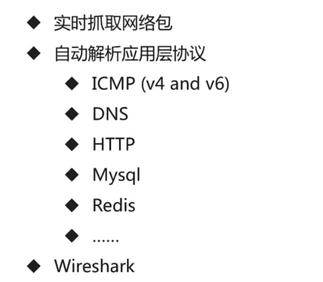


./packetbeat -e -c es.yml -strict.perms=false

## Lohstash简介

Data Shipper

> ETL
>
> Extract
>
> Transform
>
> Load


## Elastic Stack从入门到放弃

ElasticSearch   ELK  大数据分析利器

ELK VS大数据

​	快

>使用门槛低  开发周期短  上线快
>
>性能好 查询库 实时展示结果
>
>扩容方便 快速支撑增长迅速的数据规模

ELK


> Search is something that any application should have


### 课程安排

​	

> elasticsearch篇
>
> beats篇
>
> Logstath篇
>
> Kibaba篇
>
> 实践篇

### ElasticSearch篇

> 什么是倒排索引  他的组成是什么
>
> 常见的相关性算分方法有哪些
>
> 为什么查询语句没有返回预期的文档
>
> 常用的数据类型有哪些 text和keyworld的区别是什么
>
> 集群是如何搭建起来的 是如何实现故障转移的
>
> Shard具体是由什么组成的

### 实践成果

​	搜索类项目

​	如何使用少量的代码即可搭建起一个相对完备的搜索类项目

​	慕课网日志分析

​	如何使用ElasticStack 快速的对nginx日志进行分析

​	空气质量分析

​	如何使用Elastic Stack快速分析手边的数据

### 说明

ElasticStack版本

​	6.1.1

### 学习建议

第一遍快速看完所有的视频 不求甚解

第二遍仔细看完视频 同时结合官方文档 力求掌握每个知识点

学会使用官方文档

遇到问题 多思考 善用搜索引擎 

### 常见术语

文档Document 

​	用户存在在es中的数据文档

索引 Index

​	由具有相同字段的文档列表组成

节点 Node

​	一个Elasticsearch 的运行实例 是集群的构成单元

集群 Cluster

​	由一个或多个节点组成 对外提供服务

### Document 

​	Json Object 由字段(Field)组成 常见数据类型如下

	>字符串 ：text(分词)  keyword（不分词）
	>
	>数值型： long integer short byte double float falf_float scaled_float
	>
	>布尔：boolean
	>
	>日期：date
	>
	>二进制:byte
	>
	>范围类型:integer_range float_range long_range  doubole_range date_range


### Document Meta

元数据 用于标注文档的相关信息

	>_index:文档所在的索引名
	>
	>_type:文档所在的类型名
	>
	>_id:文档唯一id 
	>
	>_uid:组合id  由 _type和_id组成(6.x  _type不在起作用 同_  _id)
	>
	>_source:文档的原始Json数据 可以从这里获取每个字段的内容
	>
	>_all:整合所有的字段内容到该字段 默认禁用

### Index

​	索引中存储具有相同结构的文档

​		每个索引都有自己的mapping定义 用于定义**字段名**和**类型**

一个集群可以有多个索引,比如 ：

​		nginx日志存储的时候可以按照日期每天生成一个索引来存储

### 创建索引与写入数据


​	

### 索引API

​	es有专门的Index API 用于创建 更新 删除索引等配置

​	创建

​	

```json
PUT /test_index
//响应
{
  "acknowledged": true,
  "shards_acknowledged": true,
  "index": "test_index"
}
//查看现有索引
GET /_cat/indices
//删除索引
DELETE test_index
```

### Document API

es有专门的Document API

创建文档

​	创建文档时 如果索引不存在 es会自动创建对应的index和type

```json
PUT test_index/doc/1
{
  "username":"kakxi",
  "age":1
}
//响应
{
  "_index": "test_index",
  "_type": "doc",
  "_id": "1",
  "_version": 1,
  "result": "created",
  "_shards": {
    "total": 2,
    "successful": 2,
    "failed": 0
  },
  "created": true
}
//不指定id创建文档api
POST test_index/doc
{
  "username":"mingren",
  "age":2
}
{
  "_index": "test_index",
  "_type": "doc",
  "_id": "AWiVVP7KsRTxe9RlB7ww",
  "_version": 1,
  "result": "created",
  "_shards": {
    "total": 2,
    "successful": 2,
    "failed": 0
  },
  "created": true
}
```


查询文档

```json
//request
GET test_index/doc/1
//response 存在数据 _source存储了文档的完整的原始文件数据
{
  "_index": "test_index",
  "_type": "doc",
  "_id": "1",
  "_version": 1,
  "found": true,
  "_source": {
    "username": "kakxi",
    "age": 1
  }
}
//response 404 NOTFOUND
{
  "_index": "test_index",
  "_type": "doc",
  "_id": "3",
  "found": false
}
//搜索所有的文档 用到_search
//request
GET test_index/doc/_search
//response
{
  "took": 39,
  "timed_out": false,
  "_shards": {
    "total": 5,
    "successful": 5,
    "skipped": 0,
    "failed": 0
  },
  "hits": {
    "total": 2,
    "max_score": 1,
    "hits": [
      {
        "_index": "test_index",
        "_type": "doc",
        "_id": "AWiVVP7KsRTxe9RlB7ww",
        "_score": 1,
        "_source": {
          "username": "mingren",
          "age": 2
        }
      },
      {
        "_index": "test_index",
        "_type": "doc",
        "_id": "1",
        "_score": 1,
        "_source": {
          "username": "kakxi",
          "age": 1
        }
      }
    ]
  }
}

GET test_index/doc/_search
{
  "query": {
    "term": {
      "_id": {
        "value": "1"
      }
    }
  }
}
```

批量创建文档API

es允许一次创建多个文档 从而减少网络传输开销 提升写入速率

endpoint为 _bulk


action_type:

​	index :创建文档 如果文档已经存在 则覆盖

​	update：更新

​	create:创建 如果文档已经存在 则报错

​	delete :删除文档

```json
POST _bulk
{"index":{"_index":"test_index","_type":"doc","_id":3}}
{"username":"you","age":4}
{"index":{"_index":"test_index","_type":"doc","_id":4}}
{"username":"zhishui","age":5}
```


批量查询文档API

​	es允许一次查询多个文档

​	endpoint为_mget如下

```json
GET /test_index/doc/_mget
{
  "docs":[
    {"_id":1},
    {"_id":3},
    {"_id":4}
    ]
}
```


更新文档

删除文档


正排索引

文档id到文档内容 单词的关联关系


倒排索引

​	单词到文档id的关联关系


倒排索引是搜索引擎的核心 主要包含两部分

​	单词词典(term Dictionary)

​	倒排列表(Posting List)

单词列表 是倒排索引的重要组成

​	记录所有文档的单词 一般都比较大

​	记录单词到倒排列表的关联信息

单词字典 的实现一般采用的是B+Tree

倒排列表(Posting List) 记录了单词对应的文档集合 鼬倒排索引项组成

倒排索引项（Posting） 主要包含了如下信息:

​	文档Id 用于获取原始信息

​	单词频率(TF term frequency) 记录该单词在该文档出现的次数 用于后续相关性算分

​	位置 (Position) 记录单词在文档中的分词位置(多个)用于做词语搜索

​	偏移(Offset) 记录单词在文档的开始和结束位置 用于做高亮显示


es存储的是一个json格式的文档 其中包含多个字段 每个字段都会有自己的倒排索引 


### 分词

​	分词是指将文本转换层一系列单词(term or token)的过程 也可以叫做文本分析 在es里面称为**Analysis**:如下图所示:

​	

分词器是es中专门处理分词的组件 英文为Analyzer 他的组成如下:

​	**Character Filters:**

​		针对元素文本进行处理 如何去除html特殊标记符

​	**Tokenizer:**

​		将元素文本按照一定规则切分为单词

​	**Token Filters:**

​		针对 Tokenizer处理的单词进行再加工 比如转小写 删除或者新增处理


### Analyze API

es提供了一个测试分词的api接口  方便验证分词效果

endpoint是**_anakyze** 

	>可以直接指定analyzer进行测试
	>
	>可以直接指定索引中的字段进行测试
	>
	>可以自定义分词器进行测试

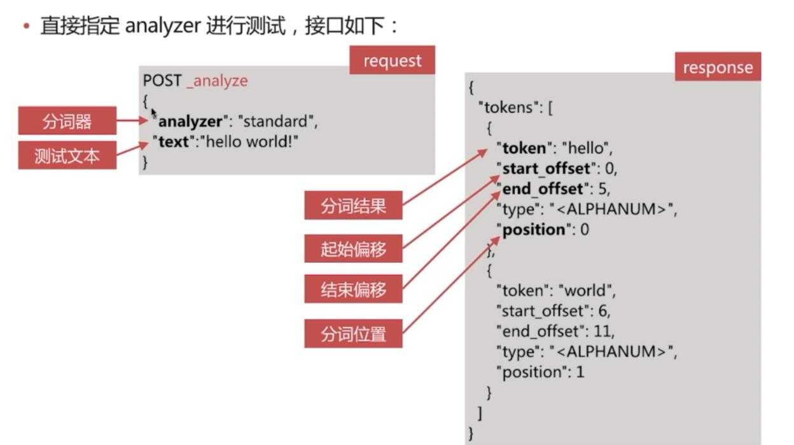

```json
//request
POST _analyze

{

  "analyzer": "standard",

  "text": "hello world"
}
//response
{
  "tokens": [
    {
      "token": "hello",
      "start_offset": 0,
      "end_offset": 5,
      "type": "<ALPHANUM>",
      "position": 0
    },
    {
      "token": "world",
      "start_offset": 6,
      "end_offset": 11,
      "type": "<ALPHANUM>",
      "position": 1
    }
  ]
}

```


```json
//request
POST test_index/_analyze
{
  "field": "username",
  "text": "宇智波鼬"
}
//response
{
  "tokens": [
    {
      "token": "宇",
      "start_offset": 0,
      "end_offset": 1,
      "type": "<IDEOGRAPHIC>",
      "position": 0
    },
    {
      "token": "智",
      "start_offset": 1,
      "end_offset": 2,
      "type": "<IDEOGRAPHIC>",
      "position": 1
    },
    {
      "token": "波",
      "start_offset": 2,
      "end_offset": 3,
      "type": "<IDEOGRAPHIC>",
      "position": 2
    },
    {
      "token": "鼬",
      "start_offset": 3,
      "end_offset": 4,
      "type": "<IDEOGRAPHIC>",
      "position": 3
    }
  ]
}

```

自定义分词器测试

```json
//request
POST _analyze
{
  "tokenizer": "standard",
  "filter":["lowercase"],
  "text": ["Hello World"]
}
//response
{
  "tokens": [
    {
      "token": "hello",
      "start_offset": 0,
      "end_offset": 5,
      "type": "<ALPHANUM>",
      "position": 0
    },
    {
      "token": "world",
      "start_offset": 6,
      "end_offset": 11,
      "type": "<ALPHANUM>",
      "position": 1
    }
  ]
}

```

### 预定义的分词器

es 自带的如下的分词器

> Standard
>
> Simple
>
> Whitespace
>
> Stop
>
> Keyword
>
> Pattern
>
> Language

#### Standard Analyzer

​	默认分词器

​	其组成如图：特征为:

​		按词切分 且支持多语言

​		小写处理


```json
//request
POST _analyze
{
  "analyzer": "standard",
  
  "text":"The 2 QUICK Brown-Foxes jumped over the lazy dog's bone"
}
//response
{
  "tokens": [
    {
      "token": "the",
      "start_offset": 0,
      "end_offset": 3,
      "type": "<ALPHANUM>",
      "position": 0
    },
    {
      "token": "2",
      "start_offset": 4,
      "end_offset": 5,
      "type": "<NUM>",
      "position": 1
    },
    {
      "token": "quick",
      "start_offset": 6,
      "end_offset": 11,
      "type": "<ALPHANUM>",
      "position": 2
    },
    {
      "token": "brown",
      "start_offset": 12,
      "end_offset": 17,
      "type": "<ALPHANUM>",
      "position": 3
    },
    {
      "token": "foxes",
      "start_offset": 18,
      "end_offset": 23,
      "type": "<ALPHANUM>",
      "position": 4
    },
    {
      "token": "jumped",
      "start_offset": 24,
      "end_offset": 30,
      "type": "<ALPHANUM>",
      "position": 5
    },
    {
      "token": "over",
      "start_offset": 31,
      "end_offset": 35,
      "type": "<ALPHANUM>",
      "position": 6
    },
    {
      "token": "the",
      "start_offset": 36,
      "end_offset": 39,
      "type": "<ALPHANUM>",
      "position": 7
    },
    {
      "token": "lazy",
      "start_offset": 40,
      "end_offset": 44,
      "type": "<ALPHANUM>",
      "position": 8
    },
    {
      "token": "dog's",
      "start_offset": 45,
      "end_offset": 50,
      "type": "<ALPHANUM>",
      "position": 9
    },
    {
      "token": "bone",
      "start_offset": 51,
      "end_offset": 55,
      "type": "<ALPHANUM>",
      "position": 10
    }
  ]
}
```

#### Simple Analyzer

其组成如图,特征为:

​	按照非字母切分

​	小写处理


```json
//rerquest
POST _analyze
{
  "analyzer": "simple",
  
  "text":"The 2 QUICK Brown-Foxes jumped over the lazy dog's bone"
}
//response
{
  "tokens": [
    {
      "token": "the",
      "start_offset": 0,
      "end_offset": 3,
      "type": "word",
      "position": 0
    },
    {
      "token": "quick",
      "start_offset": 6,
      "end_offset": 11,
      "type": "word",
      "position": 1
    },
    {
      "token": "brown",
      "start_offset": 12,
      "end_offset": 17,
      "type": "word",
      "position": 2
    },
    {
      "token": "foxes",
      "start_offset": 18,
      "end_offset": 23,
      "type": "word",
      "position": 3
    },
    {
      "token": "jumped",
      "start_offset": 24,
      "end_offset": 30,
      "type": "word",
      "position": 4
    },
    {
      "token": "over",
      "start_offset": 31,
      "end_offset": 35,
      "type": "word",
      "position": 5
    },
    {
      "token": "the",
      "start_offset": 36,
      "end_offset": 39,
      "type": "word",
      "position": 6
    },
    {
      "token": "lazy",
      "start_offset": 40,
      "end_offset": 44,
      "type": "word",
      "position": 7
    },
    {
      "token": "dog",
      "start_offset": 45,
      "end_offset": 48,
      "type": "word",
      "position": 8
    },
    {
      "token": "s",
      "start_offset": 49,
      "end_offset": 50,
      "type": "word",
      "position": 9
    },
    {
      "token": "bone",
      "start_offset": 51,
      "end_offset": 55,
      "type": "word",
      "position": 10
    }
  ]
}
```

#### Whitespace Analyzer

​	其组成如图:特性为

​		按照空格切分

​	

```json
//request
POST _analyze
{
  "analyzer": "whitespace",
  
  "text":"The 2 QUICK Brown-Foxes jumped over the lazy dog's bone"
}
//response
{
  "tokens": [
    {
      "token": "The",
      "start_offset": 0,
      "end_offset": 3,
      "type": "word",
      "position": 0
    },
    {
      "token": "2",
      "start_offset": 4,
      "end_offset": 5,
      "type": "word",
      "position": 1
    },
    {
      "token": "QUICK",
      "start_offset": 6,
      "end_offset": 11,
      "type": "word",
      "position": 2
    },
    {
      "token": "Brown-Foxes",
      "start_offset": 12,
      "end_offset": 23,
      "type": "word",
      "position": 3
    },
    {
      "token": "jumped",
      "start_offset": 24,
      "end_offset": 30,
      "type": "word",
      "position": 4
    },
    {
      "token": "over",
      "start_offset": 31,
      "end_offset": 35,
      "type": "word",
      "position": 5
    },
    {
      "token": "the",
      "start_offset": 36,
      "end_offset": 39,
      "type": "word",
      "position": 6
    },
    {
      "token": "lazy",
      "start_offset": 40,
      "end_offset": 44,
      "type": "word",
      "position": 7
    },
    {
      "token": "dog's",
      "start_offset": 45,
      "end_offset": 50,
      "type": "word",
      "position": 8
    },
    {
      "token": "bone",
      "start_offset": 51,
      "end_offset": 55,
      "type": "word",
      "position": 9
    }
  ]
}
```

#### Stop Analyzer

​	Stop Word 指预期助词等修饰性的词语 比如the an 的 这 等等

其组成如图 特性为:

​	相比Simpleanalyzer多了 Stop Word处理

​	

```json
//request
POST _analyze
{
  "analyzer": "stop",
  
  "text":"The 2 QUICK Brown-Foxes jumped over the lazy dog's bone"
}
//response
{
  "tokens": [
    {
      "token": "quick",
      "start_offset": 6,
      "end_offset": 11,
      "type": "word",
      "position": 1
    },
    {
      "token": "brown",
      "start_offset": 12,
      "end_offset": 17,
      "type": "word",
      "position": 2
    },
    {
      "token": "foxes",
      "start_offset": 18,
      "end_offset": 23,
      "type": "word",
      "position": 3
    },
    {
      "token": "jumped",
      "start_offset": 24,
      "end_offset": 30,
      "type": "word",
      "position": 4
    },
    {
      "token": "over",
      "start_offset": 31,
      "end_offset": 35,
      "type": "word",
      "position": 5
    },
    {
      "token": "lazy",
      "start_offset": 40,
      "end_offset": 44,
      "type": "word",
      "position": 7
    },
    {
      "token": "dog",
      "start_offset": 45,
      "end_offset": 48,
      "type": "word",
      "position": 8
    },
    {
      "token": "s",
      "start_offset": 49,
      "end_offset": 50,
      "type": "word",
      "position": 9
    },
    {
      "token": "bone",
      "start_offset": 51,
      "end_offset": 55,
      "type": "word",
      "position": 10
    }
  ]
}
```

#### Keyword analyzer

​	 其组成如图,特性为:

​	 不分词，直接将输入作为一个单词输出


```json
//request
POST _analyze
{
  "analyzer": "keyword",
  
  "text":"The 2 QUICK Brown-Foxes jumped over the lazy dog's bone"
}
//response
{
  "tokens": [
    {
      "token": "The 2 QUICK Brown-Foxes jumped over the lazy dog's bone",
      "start_offset": 0,
      "end_offset": 55,
      "type": "word",
      "position": 0
    }
  ]
}
```

#### Pattern Analyzer

​	其组成如图,特性为:

​		通过正则表达式自定义分隔符

​		默认为\W+,即非字词的符号作为分割符


```json
//request
POST _analyze
{
  "analyzer": "pattern",
  
  "text":"The 2 QUICK Brown-Foxes jumped over the lazy dog's bone"
}
//response
{
  "tokens": [
    {
      "token": "the",
      "start_offset": 0,
      "end_offset": 3,
      "type": "word",
      "position": 0
    },
    {
      "token": "2",
      "start_offset": 4,
      "end_offset": 5,
      "type": "word",
      "position": 1
    },
    {
      "token": "quick",
      "start_offset": 6,
      "end_offset": 11,
      "type": "word",
      "position": 2
    },
    {
      "token": "brown",
      "start_offset": 12,
      "end_offset": 17,
      "type": "word",
      "position": 3
    },
    {
      "token": "foxes",
      "start_offset": 18,
      "end_offset": 23,
      "type": "word",
      "position": 4
    },
    {
      "token": "jumped",
      "start_offset": 24,
      "end_offset": 30,
      "type": "word",
      "position": 5
    },
    {
      "token": "over",
      "start_offset": 31,
      "end_offset": 35,
      "type": "word",
      "position": 6
    },
    {
      "token": "the",
      "start_offset": 36,
      "end_offset": 39,
      "type": "word",
      "position": 7
    },
    {
      "token": "lazy",
      "start_offset": 40,
      "end_offset": 44,
      "type": "word",
      "position": 8
    },
    {
      "token": "dog",
      "start_offset": 45,
      "end_offset": 48,
      "type": "word",
      "position": 9
    },
    {
      "token": "s",
      "start_offset": 49,
      "end_offset": 50,
      "type": "word",
      "position": 10
    },
    {
      "token": "bone",
      "start_offset": 51,
      "end_offset": 55,
      "type": "word",
      "position": 11
    }
  ]
}
```

#### Language Analyzer


#### 中文分词

​	中文诗词是指将一个汉字序列切分成一个一个单独的词 在英文中 单词之间是以空格作为自然分隔符 汉语中没有一个形式上的分界符

### 蝉蛹分词系统

​	IK

​		实现中英文单词的切分 支持ik_smart ik_maxword等模式

​		可自定词库 支持热更细分词词典

​		https://github.com/medcl/elasticsearch-analysis-ik


```json
//request
POST  _analyze
{
  "analyzer": "ik_max_word",
  "text":"中华人民共和国"
}
//response
{
  "tokens": [
    {
      "token": "中华人民共和国",
      "start_offset": 0,
      "end_offset": 7,
      "type": "CN_WORD",
      "position": 0
    },
    {
      "token": "中华人民",
      "start_offset": 0,
      "end_offset": 4,
      "type": "CN_WORD",
      "position": 1
    },
    {
      "token": "中华",
      "start_offset": 0,
      "end_offset": 2,
      "type": "CN_WORD",
      "position": 2
    },
    {
      "token": "华人",
      "start_offset": 1,
      "end_offset": 3,
      "type": "CN_WORD",
      "position": 3
    },
    {
      "token": "人民共和国",
      "start_offset": 2,
      "end_offset": 7,
      "type": "CN_WORD",
      "position": 4
    },
    {
      "token": "人民",
      "start_offset": 2,
      "end_offset": 4,
      "type": "CN_WORD",
      "position": 5
    },
    {
      "token": "共和国",
      "start_offset": 4,
      "end_offset": 7,
      "type": "CN_WORD",
      "position": 6
    },
    {
      "token": "共和",
      "start_offset": 4,
      "end_offset": 6,
      "type": "CN_WORD",
      "position": 7
    },
    {
      "token": "国",
      "start_offset": 6,
      "end_offset": 7,
      "type": "CN_CHAR",
      "position": 8
    }
  ]
}
```


​	jieba

​	python中最流行的你分词系统 支持分词和词性标注

​	支持繁体分词 自定义词典 并行分词等

​	https://github.com/fxsjy/jieba


当自带的分词无法满足需求的时候 可以自定义分词

​	通过自定义Character Filters Tokennizer 和 Token Filter实现

### Character Filtrers

​	在Tokenizer之前堆元素文本进行处理 比如增加 删除 替换字符等

​	自带的如下:

		>HTML Strip 去除 html标签和转换html实体
		>
		>Mapping进行字符替换操作
		>
		>Pattern Replace进行正则匹配替换

​	会影响后续的tokenizer解析的postion和offset信息


#### Character Filters测试时可以采用如下api


```json
//keyword类型的tokenizer可以直接看到输出结果
//指明要使用的char_filter
POST  _analyze
{
   "char_filter": ["html_strip"], 
  "tokenizer": "keyword",
  "text":"<span class=\"importproblem_btn fl\">导入弹题</span>"
}

{
  "tokens": [
    {
      "token": "导入弹题",
      "start_offset": 35,
      "end_offset": 46,
      "type": "word",
      "position": 0
    }
  ]
}
```

### Tokenizer

​	将原始文办按照一定规则切分为单词(term or token)

​	自带的如下:

	>standard按照单词进行分割
	>
	>letter按照非字符类进行分割
	>
	>whitespace按照空格进行分割
	>
	>UAX URL email按照standard分割 但不会分割邮箱和url
	>
	>NGram 和Edge Ngram连词分割
	>
	>PathHierarchy按照文件路径进行分割

```json
//指定要测试的tokennizer 
POST _analyze
{
  "tokenizer": "path_hierarchy",
  "text":"/one/two/three"
}
{
  "tokens": [
    {
      "token": "/one",
      "start_offset": 0,
      "end_offset": 4,
      "type": "word",
      "position": 0
    },
    {
      "token": "/one/two",
      "start_offset": 0,
      "end_offset": 8,
      "type": "word",
      "position": 0
    },
    {
      "token": "/one/two/three",
      "start_offset": 0,
      "end_offset": 14,
      "type": "word",
      "position": 0
    }
  ]
}
```

### Token Filters 

​	d队友tokenizer输出的单词(term)进行增加 删除 修改等操作

​	自带的如下:

	>lowercase将所有term转换为小写
	>
	>stop 删除stop words
	>
	>NGram 和Edge Ngram连词分割
	>
	>Synonym 添加近义词的term

```json
POST _analyze
{
  "text":"a Hello World!",
  "tokenizer":"standard",
  "filter": [
    "stop",
    "lowercase",
    {
      "type":"ngram",
      "min_gram":4,
      "max_gram":4
    }
    ]
}

{
  "tokens": [
    {
      "token": "hell",
      "start_offset": 2,
      "end_offset": 7,
      "type": "<ALPHANUM>",
      "position": 1
    },
    {
      "token": "ello",
      "start_offset": 2,
      "end_offset": 7,
      "type": "<ALPHANUM>",
      "position": 1
    },
    {
      "token": "worl",
      "start_offset": 8,
      "end_offset": 13,
      "type": "<ALPHANUM>",
      "position": 2
    },
    {
      "token": "orld",
      "start_offset": 8,
      "end_offset": 13,
      "type": "<ALPHANUM>",
      "position": 2
    }
  ]
}
```

### 自定义分词

​	自定义分词的api

​	自定义分词需要在索引配置中设定:

​	

```json
PUT  /my_index
{
  "settings": {
    "analysis": {
      "char_filter": {},
      "tokenizer": {},
      "filter": {},
      "analyzer": {}
      
    }
  }
```


```json

PUT  /my_index
{
  "settings": {
    "analysis": {
      "analyzer": {
        "my_custom_analyzer":{
          "type":"custom",
          "char_filter":[
            "html_strip"
            ],
          "tokenzier":"standard",
            "filter":[
              "lowercas",
              "asciifolding"
            ]
        }
      }
      
    }
  }
}
```


### 分词使用说明

​	分词会在如下两个时机使用

​		创建或更新文档时(Index Time)会对想要的文档进行分词处理

​		查询时(Search Time) 会对查询语句进行分词


索引时分词 是通过配置Index Mapping中的每个字段的analyzer属性实现的 如下:不指定分词时 使用默认standard

```json
PUT /myindex
{
"mappings": {
  "doc":{
    "properties": {
      "title":{
        "type": "text",
        "analyzer": "whitespace"
      }
    }
  }
}
}
```

查询是分词是指指定方式有如下几种：


​	查询的时候通过analyzer指定分词器

​	通过index mapping 设置search_analyzer

```json
GET  /myindex/_search
{
  "query": {
    "match": {
      "message":{
        "query":"hello",
        "analyzer":"standard"
      }
    }
  }
}

PUT /myindex
{
"mappings": {
  "doc":{
    "properties": {
      "title":{
        "type": "text",
        "analyzer": "whitespace"
        , "search_analyzer": "standard"
      }
    }
  }
}
}
```


### 分词的使用建议

​	明确字段是否需要分词 不需要分词的字段就将type 设置为keyword 可以节省空间和挺高性能

​	善用_analyze api 查看文件的具体分词结果

​	手动测试

## Mapping

### Mapping

​	类似数据库中的表结构定义 主要作用如下:

	>定义Index下的字段名(Field Name)
	>
	>定义字段的类型 比如数值型 字符串型 布尔型等
	>
	>定义倒排索引的相关的配置 比如是否索引 记录position等

```json
//request 获取一个索引的mapping
GET /accounts/_mapping
//response
{
  "accounts": {
    "mappings": {
      "person": {
        "properties": {
          "job_description": {
            "type": "text",
            "fields": {
              "keyword": {
                "type": "keyword",
                "ignore_above": 256
              }
            }
          },
          "lastname": {
            "type": "text",
            "fields": {
              "keyword": {
                "type": "keyword",
                "ignore_above": 256
              }
            }
          },
          "name": {
            "type": "text",
            "fields": {
              "keyword": {
                "type": "keyword",
                "ignore_above": 256
              }
            }
          }
        }
      }
    }
  }
}
```

### 自定义Mapping

```json
//request
PUT /user
{
  "mappings": {
    "doc":{
      "properties": {
        "title":{
          "type": "text"
        },
        "name":{
          "type": "keyword"
        },
        "age":{
          "type": "integer"
        }
      }
    }
  }
}
//response
{
  "acknowledged": true,
  "shards_acknowledged": true,
  "index": "user"
}
```

Mapping中的字段类型一旦设定后 禁止直接修改 原因如下

​	luncene实现倒排索引生成后不允许修改

重新建立新的索引 然后reindex操作

允许新增字段 

通过dynamic参数控制字段的新增

​	-true(默认) 允许自动新增字段

​	-false 不允许自动新增字段 但是文档可以正常写入 但无法对字段进行查询等操作

​	-strict 文档不能写入 保存


```json
PUT /myindex
{
  "mappings": {
    "doc":{
      "dynamic":false,
      "properties": {
         "title":{
          "type": "text"
        },
        "name":{
          "type": "keyword"
        },
        "age":{
          "type": "integer"
        }
      }
      
    }
  }
}
//查询
GET /myindex/_mapping
//响应
{
  "myindex": {
    "mappings": {
      "doc": {
        "dynamic": "false",
        "properties": {
          "age": {
            "type": "integer"
          },
          "name": {
            "type": "keyword"
          },
          "title": {
            "type": "text"
          }
        }
      }
    }
  }
}

```

#### copy_to

​	将该字段的值赋值到目标字段  实现类似_all的作用

​	不会出现在_source中 只用来搜索

```json
//创建索引
PUT  user
{
  "mappings": {
    "doc": {
      "properties": {
        "first_name":{
          "type": "text",
          "copy_to": "full_name"
        },
        "last_name":{
          "type": "text",
          "copy_to": "full_name"
        },
        "full_name":{
          "type": "text"
        }
      }
    }
  }
}
//插入文档
PUT  user/doc/1
{
  "first_name":"yuzhibo",
  "last_name":"you"
}
//查询
GET  user/doc/_search
{
  "query": {
    "match": {
      "full_name":{
        "query": " yuzhibo you"
        , "operator": "and"
      }
    }
  }
}

```

#### index

​	控制当前字段是否索引 默认为true 即记录索引 false 不记录 即不可以搜索

```json
POST user/doc/1
{
  "name":"kakaxi",
  "cookie":"name=huoying"
}

GET  user/doc/_search
{
  "query": {
    "match": {
      "name": "kakaxi"
    }
  }
}

GET  user/doc/_search
{
  "query": {
    "match": {
      "cookie": "huoying"
    }
  }
}

{
  "error": {
    "root_cause": [
      {
        "type": "query_shard_exception",
        "reason": "failed to create query: {\n  \"match\" : {\n    \"cookie\" : {\n      \"query\" : \"huoying\",\n      \"operator\" : \"OR\",\n      \"prefix_length\" : 0,\n      \"max_expansions\" : 50,\n      \"fuzzy_transpositions\" : true,\n      \"lenient\" : false,\n      \"zero_terms_query\" : \"NONE\",\n      \"boost\" : 1.0\n    }\n  }\n}",
        "index_uuid": "hRpteGNlS9uvgn3HLlYXng",
        "index": "user"
      }
    ],
    "type": "search_phase_execution_exception",
    "reason": "all shards failed",
    "phase": "query",
    "grouped": true,
    "failed_shards": [
      {
        "shard": 0,
        "index": "user",
        "node": "o5qYEve9SCKj7FdNnqKDUw",
        "reason": {
          "type": "query_shard_exception",
          "reason": "failed to create query: {\n  \"match\" : {\n    \"cookie\" : {\n      \"query\" : \"huoying\",\n      \"operator\" : \"OR\",\n      \"prefix_length\" : 0,\n      \"max_expansions\" : 50,\n      \"fuzzy_transpositions\" : true,\n      \"lenient\" : false,\n      \"zero_terms_query\" : \"NONE\",\n      \"boost\" : 1.0\n    }\n  }\n}",
          "index_uuid": "hRpteGNlS9uvgn3HLlYXng",
          "index": "user",
          "caused_by": {
            "type": "illegal_argument_exception",
            "reason": "Cannot search on field [cookie] since it is not indexed."
          }
        }
      }
    ]
  },
  "status": 400
}
```


#### index_options

用于控制倒排索引记录的内容 有如下4中配置

> docs 只记录doc id
>
> freqs 记录doc id和 term frequencies 
>
> positions 记录doc id ,term frequencies 和 term position
>
> offsets 记录doc id  , term frequencies, term position 和character offsets 

​	text 类型默认配置为positions 其他默认为docs

​	记录内容越多 占用空间越大

​	

```json
PUT user
{
  "mappings": {
    "doc": {
      "properties": {
        "cookie":{
          "type": "text",
          "index": false,
          "index_options": "offset"
        },
        "name":{
          "type": "text"
        }
      }
    }
  }
}
```

#### null_value

当字段遇到null值时的处理策略 默认为null 即控制 此时es会忽略该值  可以通过设定null_value 设定字段的默认值

```json
PUT user
{
  "mappings": {
    "doc": {
      "properties": {
        "name":{
          "type": "text"
        },
        "age":{
          "type": "keyword",
          "null_value": 0
        }
      }
    }
  }
}
GET  user/_mapping

PUT  user/doc/1
{
  "name":"123",
  "age":null
}
PUT  user/doc/2
{
  "name":"456",
  "age":0
}
GET /user/doc/_search
{
 "query": {
   "match": {
     "age": "0"
   }
 }
  
}
```

### 数据类型

#### 核心数据类型

		>字符串型:text  keyword
		>
		>​	text会分词  keyword 不会分词
		>
		>数值型:long integer short byte  double float half_float scaled_float
		>
		>日期类型: date
		>
		>布尔类型 ：boolean
		>
		>二进制类型:binary
		>
		>范围类型(5.x新增):integer_range float_range long_range double_range  date_range
	
	#### 复杂数据类型
	
	>数组类型: array
	>
	>对象类型 Object
	>
	>嵌套内省 nested object
	>
	>地理位置数据类型
	>
	>​	geo_point
	>
	>​	geo_shape

#### 专用类型

	>记录ip地址 ip
	>
	>实现自动补全 completion
	>
	>记录分词数 token_count
	>
	>记录字符串hash值 murmur3
	>
	>percolator
	>
	>join

多字段特性 multi-field

​	允许对同一个字段采用不同的配置 比如分词 常见列子 如对人名实现拼音搜索 只需要在人名中新增一个字段为pinyin 即可

```json
PUT /user
{
  "mappings": {
    "doc": {
      "properties": {
        "username":{
          "type": "text",
          "fields": {
            "pinyin":{
              "type": "text",
              "analyzer": "pinyin"
            }
          }
        }
      }
    }
  }
}
GET user/doc/_search
{
  "query": {
    "username.pinyin":"kakaxi"
  }
}
```

#### Dynamic Mapping

es 可以自动识别文档字段类型 从而降低用户使用成本  如下所示:

```json
PUT /teacher/doc/1
{
  "username":"kakaxi",
  "age":1
}

//es 自动识别 age为long类型 username为text类型
GET /teacher/_mapping

{
  "teacher": {
    "mappings": {
      "doc": {
        "properties": {
          "age": {
            "type": "long"
          },
          "username": {
            "type": "text",
            "fields": {
              "keyword": {
                "type": "keyword",
                "ignore_above": 256
              }
            }
          }
        }
      }
    }
  }
}
```


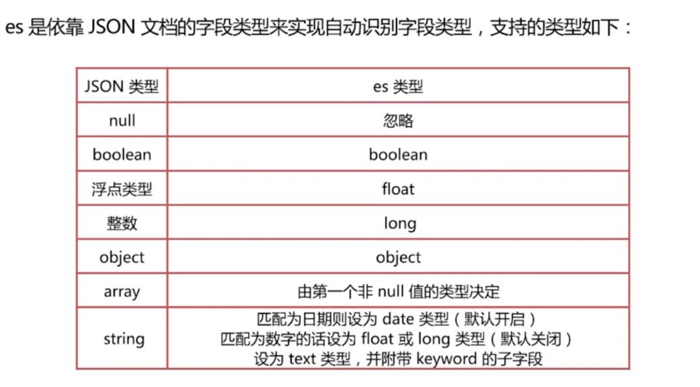

```json
PUT  /test1/doc/1
{
  "username":"kakaxi",
  "age":14,
  "birth":"1988-10-10",
  "married":false,
  "year":18,
  "tags":["boy","fashion"],
  "money":100.1
}

GET /test1/_mapping
{
  "test1": {
    "mappings": {
      "doc": {
        "properties": {
          "age": {
            "type": "long"
          },
          "birth": {
            "type": "date"
          },
          "married": {
            "type": "boolean"
          },
          "money": {
            "type": "float"
          },
          "tags": {
            "type": "text",
            "fields": {
              "keyword": {
                "type": "keyword",
                "ignore_above": 256
              }
            }
          },
          "username": {
            "type": "text",
            "fields": {
              "keyword": {
                "type": "keyword",
                "ignore_above": 256
              }
            }
          },
          "year": {
            "type": "long"
          }
        }
      }
    }
  }
}
```

日期的自动识别可以自行配置日期格式，以满洲各种需求

​	默认是["strict_date_optional_time","yyyy/MM/dd HH:mm:ss Z||yyyy/MM/dd Z"]

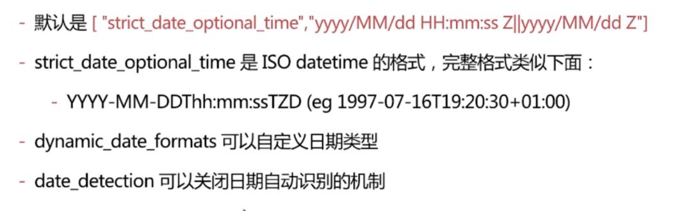

```json
//设置日期根式 关闭日期识别机制
PUT /test2
{
  "mappings": {
    "doc":{
      "dynamic_date_formats": ["yyyy-MM-dd"],
      "date_detection": false
    }
  }
}

DELETE  /test2
PUT /test2
{
  "mappings": {
    "doc":{
      "dynamic_date_formats": ["MM/dd/yyyy"]
    }
  }
}
PUT  /test2/doc/1
{
  "create_date":"09/25/2015"
}
GET  /test2/_mapping

```

字符串是数字时 默认不会自动识别为整型  因为字符串中出现数字时完全合理的

**numeric_detection** 可以开启字符串中数字的自动识别 如下所示

```json
PUT /test3
{
  "mappings": {
    "doc":{
      "numeric_detection": true
    }
  }
}

PUT /test3/doc/1
{
  "age":"15"
}

GET /test3/_mapping
```


	#### Dynamic Template

允许根据es自动识别的数据类型 字段名等来动态设定字段类型  可以实现如下效果:

​	所有字符串类型都设定为keyword类型 即默认不分词

​	所有以message开头的字段都设定为text类型 即分词

​	所有以long_开头的字段都设定为long类型

​	所有自动匹配为double类型的都设定为float类型 以节省空间

​	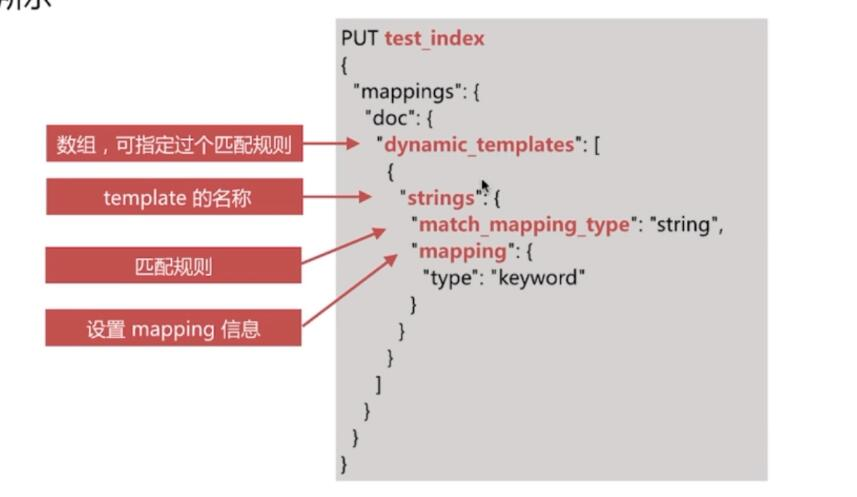


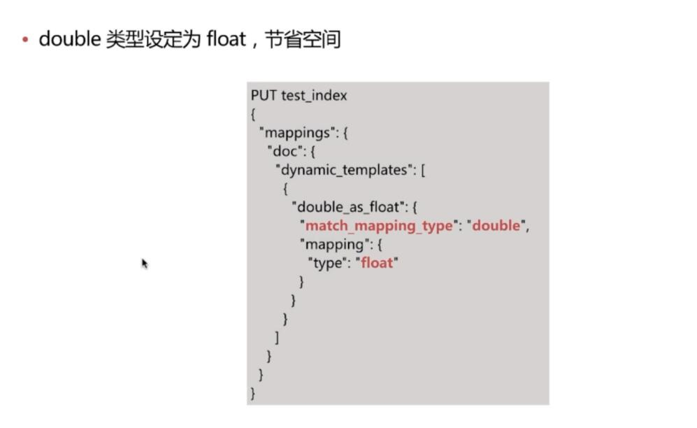


```json
PUT  /test6
{
  "mappings": {
    "doc":{
      "dynamic_templates":[
        {
           "message_as_text":{
              "match_mapping_type":"string",
              "match":"message*",
              "mapping":{
                "type":"text"
              }
            },
          "strings_as_keyword":{
            "match_mapping_type":"string",
            "mapping":{
              "type":"keyword"
            }
          }
          
        }
        ]
    }
  }
}
```


### 自定义Mapping的建议

自定义Mapping的操作步骤如下：

	>1.写入一条文档到es的临时索引中 获取es 自动生成的mapping
	>
	>2.修改步骤1得到的mapping 自定义相关配置
	>
	>3.使用步骤2的mapping创建时间所需的索引


### 索引模板

​	索引模板 因为为Index Template  主要用于在新建索引时自动应用预先设置的配置

简化索引创建的操作步骤 

​	可以设定索引的配置和Mapping

​	可以有多个模板 根据order 设置 order大的覆盖小的配置


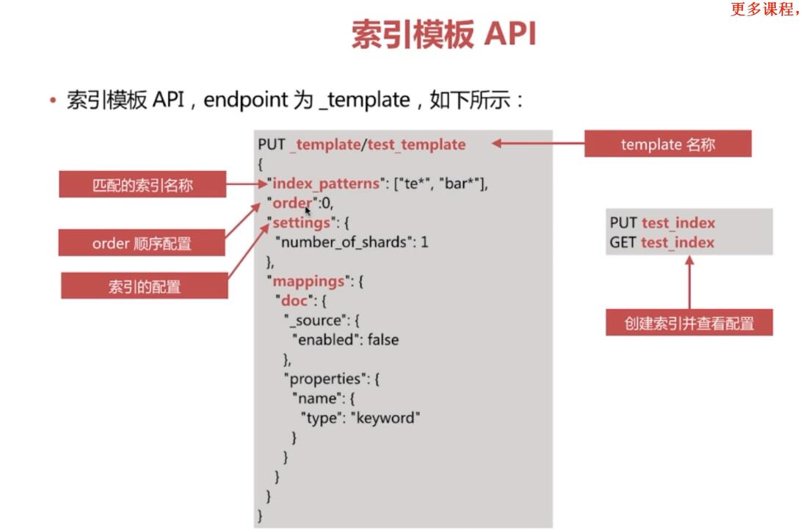

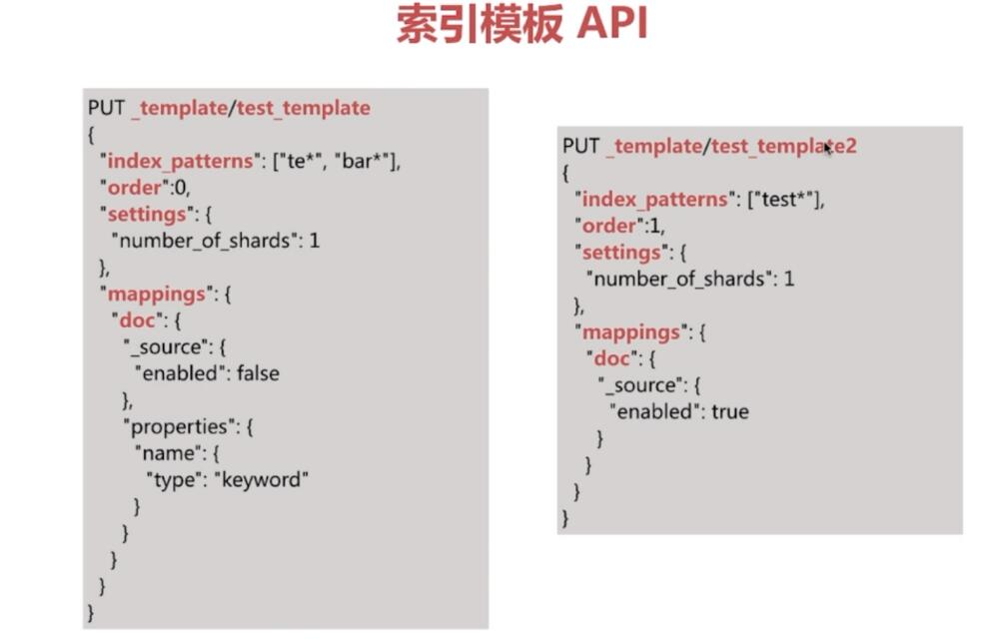

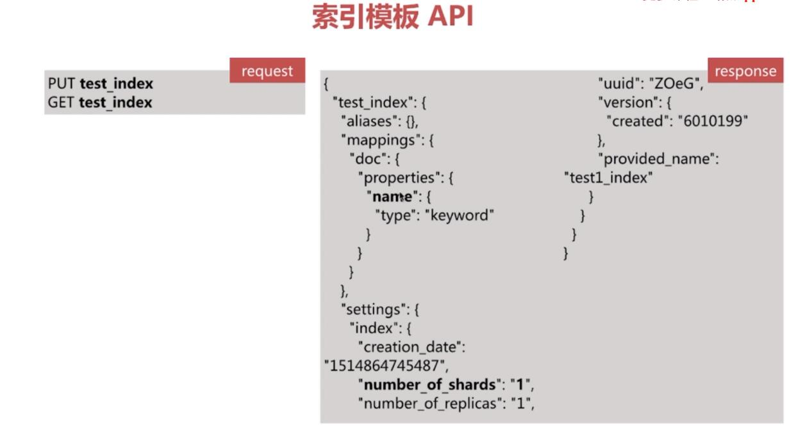


## Search API

实现对es中存储的数据进行查询分析,endpoint为_search 


查询主要有两种形式

​	URI Search

​		操作简单 方便通过命令行测试

​		仅包含部分查询语法

​	Request Body Search

​		-es提供的完备查询语法Query DSL(Domain Specific Language)

```json
GET /myindex/_search?q=user:kakaxi

	GET /myindex/_search

	{"query":{
			"term":{"user":"kakaxi"}
		}

	}

```

### URI Search

通过url query 参数来实现搜索 常用参数如下

 -  q指定查询的语句 语法为 Query String Syntax

 -  df (default field)q 中不指定字段时 默认查询的字段  如果不指定 es会查询所有的字段

 -  sort 排序

 -  timeout 指定超时时间 默认不超时

 -  from size 用于分页

    GET /test_index/doc/_search?q=username:you&sort=age&from=0&size=2

    ​

term 与phrase

​	term 是一个个单词

​	phrase是一个个词语

group 分组设定 使用括号指定匹配的规则

(quick or brown) and fox

status:(active or pending) title:(full text search)

```json
POST test_search_index/doc/_bulk

{"index":{"_id":1}}

{"username":"alfred way","job":"java engineer","age":18,"birth":"1990-01-02","isMarried":false}

{"index":{"_id":2}}

{"username":"alfred ","job":"java senior engineer and java specialist","age":28,"birth":"1980-05-07","isMarried":true}

{"index":{"_id":3}}

{"username":"lee ","job":"java and ruby engineer","age":22,"birth":"1985-08-07","isMarried":false}

{"index":{"_id":4}}

{"username":"alfred junior way ","job":"ruby engineer","age":23,"birth":"1989-08-07","isMarried":false}

```

//所有字段查询

GET  test_search_index/doc/_search?q=java

//单个字段查询

GET  test_search_index/doc/_search?q=username:alfred

//模糊匹配 

GET  test_search_index/doc/_search?q=username:alfred way

GET  test_search_index/doc/_search?q=username:(alfred way)

{

"profile":true

}

GET  test_search_index/doc/_search?q=username:"alfred way"

布尔操作符

  AND(&&),OR(||),NOT(!)

​	name:(tom NOT lee)

​	注意大写 不能小写

+- 分别对应must 和must_not

​	name:(tom +lee -alfred)

​	name:((lee &&!alfred)||(tom && lee && !alfred))

​	+在url中会被解析为空格要使用encode后的结果才可以 为%2B

GET  test_search_index/doc/_search?q=username:(alfred AND way)
{
  "profile":true
}

GET  test_search_index/_search?q=username:(alfred  -way)
{
  "profile":true
}

GET test_search_index/doc/_search?q=username:(allfred %2Bway)
{
  "profile":true
}

范围查询，支持数值和日期

​	区间写法 闭区间用[]开区间用{}

​		age:[1 TO 10] 意味着 1<=age<=10

​		age: {1 TO 10} 意味着 1<age<10

​		age:[1 to] 意味着 age>=1

​		age:[* TO 10] 意味着 age<=10

​	算术符号写法

​		age:>=1

​		age:(>=1 && <=10) 或者age:(+>=1+<=10)

//OR

GET test_search_index/doc/_search?q=username:alfred age:>26
{
  "profile":true
}

//AND

GET  test_search_index/doc/_search?q=username:alfred AND age:>20
{
  "profile":true
}

GET  test_search_index/doc/_search?q=birth:(>1980 AND <1990)

通配符查询

​	?代表1个字符  *代表0或多个字符

​	name:t?m

​	name:tom*

​	name:t*m

通配符匹配执行效率低 且占用较多内存 不建议使用

如无特殊要求 不要将? *放在最前面

正则表达式

​	name:/[mb]oat/

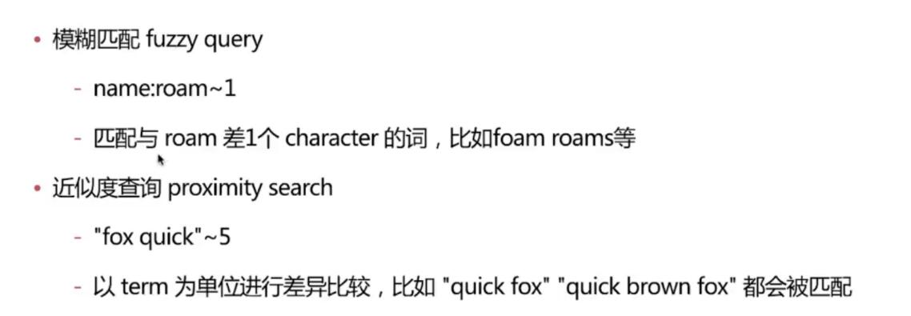


### Request Body Search

将查询语句通过http request body 发送到es 主要包含如下参数

 - query 符合query dsl语法的查询语句
 - from size
 - timeout
 - sort

  ​


基于json定义的查询语言 主要包含如下两种类型

	>字段类型查询
	>
	>​	如term  match range 等 只针对某一个字段进行查询
	>
	>复合查询
	>
	>​	如 bool查询 等 包含一个或多个字段类查询或者复合查询语句

字段类查询

​	字段类查询主要包括以下两类

		>全文匹配
		>
		>​	针对text类型的字段进行全文检索 会对查询语句先进行分词处理 如match match_phrase 等query类型
		>
		>单词匹配
		>
		>​	不会对查询的语句做分词处理 直接去匹配字段的倒排索引 如 term terms range等query类型


​	match query

​		对字段做全文检索  最基本和常用的查询类型

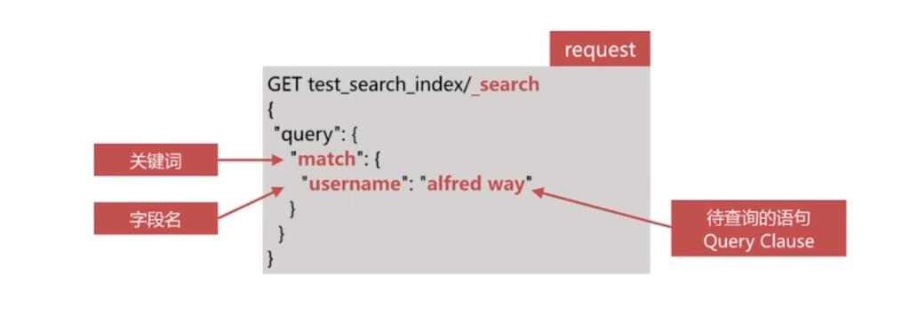

```json
GET  test_search_index/doc/_search?q=username:alfred username:way

GET  test_search_index/doc/_search
{
  "profile":true,
  "query": {
    "match": {
      "username": "alfred way"
    }
  },
  "_source": "username"
}

```

match query 流程

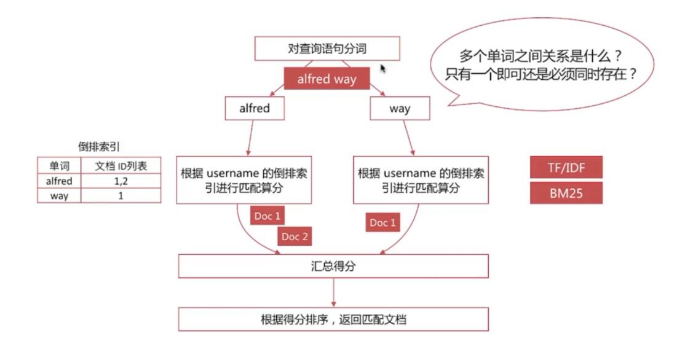

通过operator参数可以控制单词键的匹配关系 可选项为or 和and

```json
GET  test_search_index/doc/_search
{
  "query": {
    "match": {
      "username":{
        "query": "alfred way",
        "operator": "and"
      }
    }
  },
  "_source": "username"
}
```


通minimum_should_match 参数可以控制需要匹配的单词数

```json
GET  test_search_index/doc/_search
{
  "query": {
    "match": {
      "job":{
        "query": "java ruby engineer",
        "minimum_should_match":"2"
      }
    }
  },
  "_source": "job"
}
```


### 相关性算分

相关性算分是指文档与查询语句间的相关度

​	通过倒排索引 可以获取与查询语句想匹配的文档列表  那么如何将最符合用户查询的需求的文档放到前列呢

​	本质是一个排序问题  排序的已经是相关性算分

相关性算分的几个重要概念:

​	Term Frequency(TF) 词频 即单词在该文档出现的次数 词频越高 相关度越高

​	Do

### Range Query

​	范围查询主要针对数值和日期类型

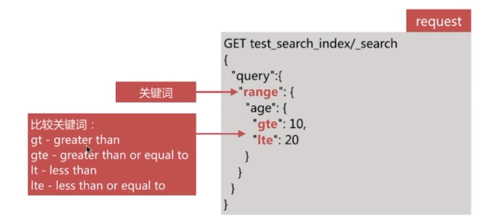

```json
GET /test1/doc/_search
{
  "query": {
    "range": {
      "age": {
        "gte": 10,
        "lte": 20
      }
    }
  }
}
```


针对日期做查询

```json
GET test1/_search
{
  "query": {
    "range": {
      "birth": {
        "lt": "1990-10-10"
        
      }
    }
  }
}

GET test1/_search
{
  "query": {
    "range": {
      "birth": {
        "lt":"now-20y"
        
      }
    }
  }
}
```


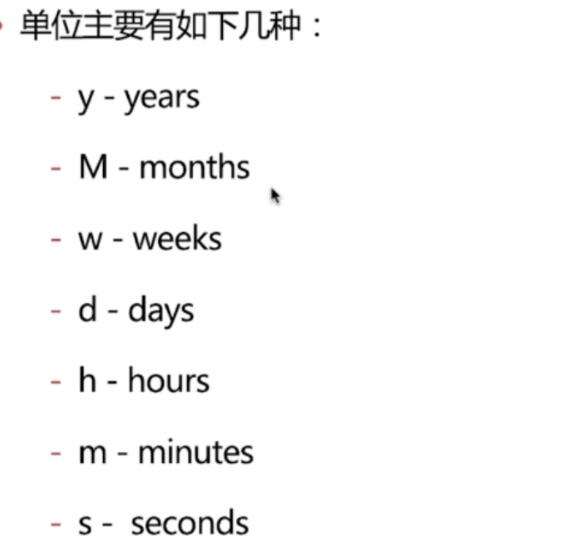

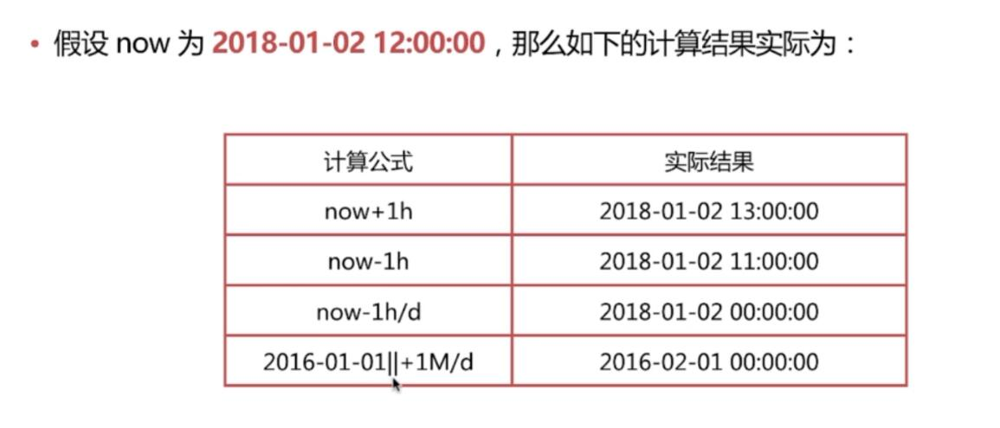

### 复合查询

​	复合查询是指包含字段类查询 或复合查询的类型，主要包括以下几类

 -  constant_score query

 -  bool query

 -  dis_max query

 -  cunction_score query

 -  boosting query

    ​

#### Constant Score Query

该查询将其内部的查询结构文档得分都设定为1 或者 boost的值

多用于结合bool查询实现自定义得分

```json
GET test_index/doc/_search
{
  "query": {
    "constant_score": {
      "filter": {
        "term": {
          "username": "you"
        }
      }
    
    }
  }
}
```

####Bool Query

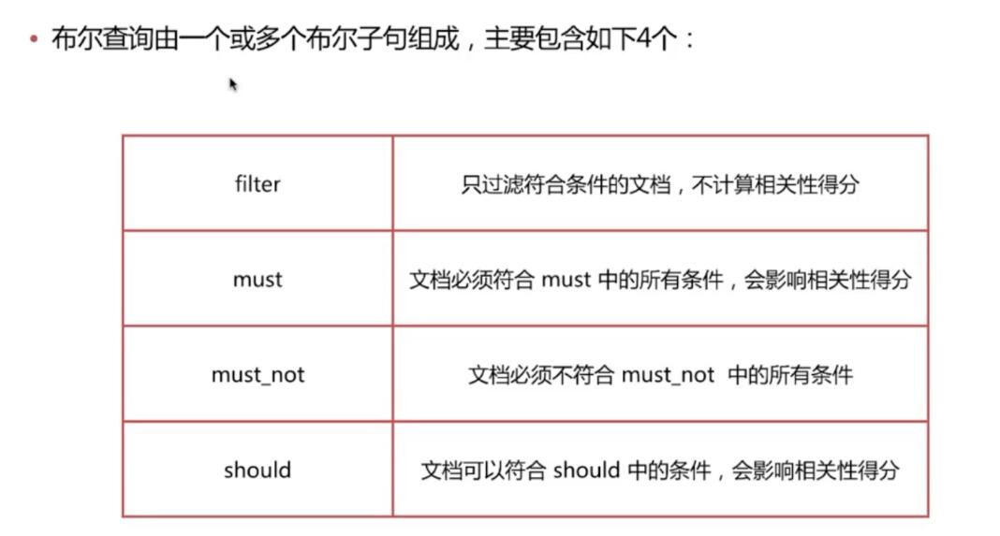

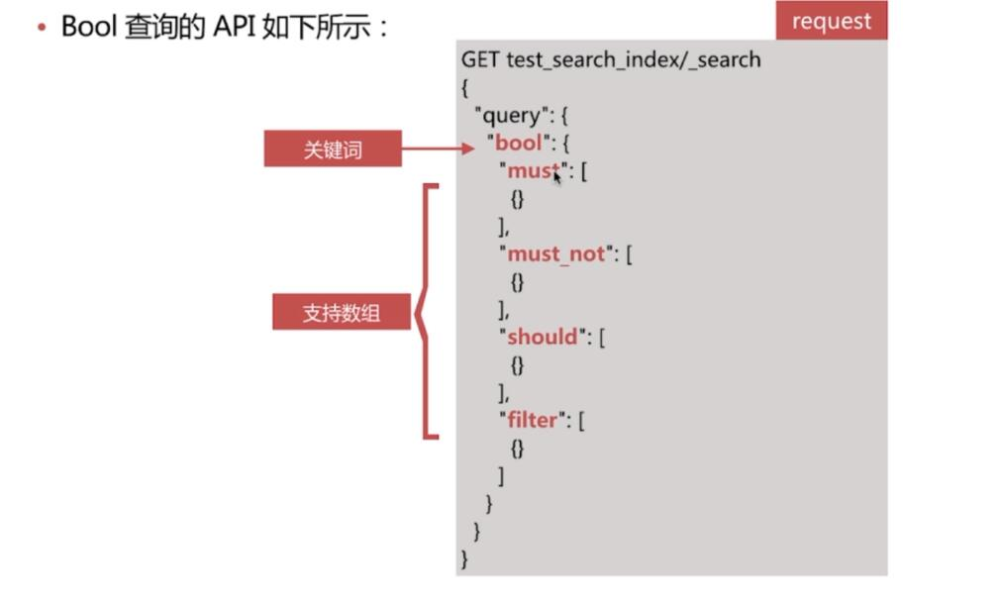

### 龙果ES

```json
//查看集群的健康状况
GET /_cluster/health
{
  "cluster_name" : "elasticsearch",
  "status" : "yellow",
  "timed_out" : false,
  "number_of_nodes" : 1,
  "number_of_data_nodes" : 1,
  "active_primary_shards" : 93,
  "active_shards" : 93,
  "relocating_shards" : 0,
  "initializing_shards" : 0,
  "unassigned_shards" : 60,
  "delayed_unassigned_shards" : 0,
  "number_of_pending_tasks" : 0,
  "number_of_in_flight_fetch" : 0,
  "task_max_waiting_in_queue_millis" : 0,
  "active_shards_percent_as_number" : 60.78431372549019
}

```

```json
//查看集群的信息
GET _cat/health?v
epoch      timestamp cluster       status node.total node.data shards pri relo init unassign pending_tasks max_task_wait_time active_shards_percent
1550662542 11:35:42  elasticsearch yellow          1         1     93  93    0    0       60             0                  -                 60.8%

```

```json
//查看集群中的索引
GET _cat/indices?v
health status index                           uuid                   pri rep docs.count docs.deleted store.size pri.store.size
green  open   .monitoring-es-6-2019.02.19     JLvrNW86QMqPAYApRTFqgQ   1   0     302700         1661    152.8mb        152.8mb

```


```json
//创建索引
PUT /test_index
{
  "acknowledged" : true,
  "shards_acknowledged" : true,
  "index" : "test_index"
}
//删除索引
DELETE /test_index
{
  "acknowledged" : true
}

```

```json
//插入数据
PUT /eco/doc/1
{
  "name":"gaolujie yagao",
  "desc":"gaoxiao meibai",
  "price":30,
  "producer":"gaolujie producer",
  "tags":["meibai","fangzhu"]
}

PUT /eco/doc/2
{
  "name":"jiajieshi yagao",
  "desc":"youxiao fangzhu",
  "price":25,
  "producer":"jiajieshi producer",
  "tags":["fangzhu"]
}

PUT /eco/doc/3
{
  "name":"zhonghua yagao",
  "desc":"caoben zhiwu",
  "price":40,
  "producer":"zhonghua producer",
  "tags":["qingxin"]
}
//响应
{
  "_index" : "eco",
  "_type" : "doc",
  "_id" : "1",
  "_version" : 1,
  "result" : "created",
  "_shards" : {
    "total" : 2,
    "successful" : 1,
    "failed" : 0
  },
  "_seq_no" : 1,
  "_primary_term" : 1
}

//查询
GET /eco/doc/1
{
  "_index" : "eco",
  "_type" : "doc",
  "_id" : "1",
  "_version" : 1,
  "_seq_no" : 0,
  "_primary_term" : 1,
  "found" : true,
  "_source" : {
    "name" : "gaolujie yagao",
    "desc" : "gaoxiao meibai",
    "price" : 30,
    "producer" : "gaolujie producer",
    "tags" : [
      "meibai",
      "fangzhu"
    ]
  }
}
//更新 part更新
POST /eco/doc/1/_update
{
  "doc": {
    "name":"jiaqiang gaolujie yagao"
  }
}
//更新 全量
PUT /eco/doc/1
{
   "name":"gaolujie yagaoxxxx",
  "desc":"gaoxiao meibai",
  "price":30,
  "producer":"gaolujie producer",
  "tags":["meibai","fangzhu"]
}
//删除 
DELETE /eco/doc/1
//响应
{
  "_index" : "eco",
  "_type" : "doc",
  "_id" : "1",
  "_version" : 3,
  "result" : "deleted",
  "_shards" : {
    "total" : 2,
    "successful" : 1,
    "failed" : 0
  },
  "_seq_no" : 2,
  "_primary_term" : 1
}


```

### P7

query string search

​	GET /eco/_search?q=name:yagao&sort=price:desc

query DSL

```json
#查询所有商品
GET /eco/_search
{
  "query": {
    "match_all": {}
  }
}
# 查询名称包含牙膏 降序排序
GET /eco/_search
{
  "query": {
    "match": {
      "name": "yagao"
    }
  },
  "sort": [
    {
      "price": {
        "order": "desc"
      }
    }
  ]
}
#分页查询商品
GET /eco/_search
{
  "query": {
    "match": {
      "name": "yagao"
    }
  },
  "sort": [
    {
      "price": {
        "order": "desc"
      }
    }
  ],
  "from": 1,
  "size": 1
}

#指定商品名称和价格
GET /eco/_search
{
  "query": {
    "match_all": {}
  },
  "_source": ["name","price"]
}


PUT /eco/doc/4
{
   "name" : "special yagao",
          "desc" : "tianran xuanku",
          "price" : 50,
          "producer" : "special yagao producer",
          "tags" : [
            "special"
          ]
}

GET /eco/_search
{
  "query": {
    "match": {
      "producer":"yagao producer"
    }
  }
}

GET /eco/_search
{
  "query": {
    "match_phrase": {
      "producer": "yagao  producer"
    }
  }
}
//高亮
GET /eco/_search
{
  "query": {
    "multi_match": {
      "query": "yagao",
      "fields": ["name","producer"]
    }
  },
  "highlight": {
    "fields": {
      "producer": {},
      "name": {}
    }
  }
}
```


query filter

```json
//名称包含牙膏 且价格大于25的
GET /eco/_search
{
  "query": {
    "bool": {
      "must": [
        {"match": {
          "name": "yagao"
        }}
      ],
      "filter": {
        "range": {
          "price": {
            "gt": 25
          }
        }
      }
    }
  }
}
```

aggs

```json
PUT /eco/_mapping/doc
{
  "properties": {
    "tags":{
      "type": "text", 
      "fielddata": true
    }
  }
}
//计算每个tag 下商品数量
GET /eco/_search
{
  "size": 0, 
  "aggs": {
    "group_by_tags": {
      "terms": {
        "field": "tags",
        "size": 10
      }
    }
  }
}

```

```json

#名称中包含牙膏的商品按照tag分组
GET /eco/_search
{
  "size": 0, 
  "query": {
    "match": {
      "name": "yagao"
    }
  },
  "aggs": {
    "group_by_tag": {
      "terms": {
        "field": "tags"

      }
    }
  }
}
//按照tag分组后 求平均价格 再排序
GET /eco/_search
{
  "size": 0, 
  "aggs": {
    "group_by_tag": {
      "terms": {
        "field": "tags"
        , "order": {
          "price_avg": "asc"
        }
      },
      "aggs": {
        "price_avg": {
          "avg": {
            "field": "price"
          }
        }
      }
    }
  }
}

GET /eco/_search
{
  "size":0,
  "aggs": {
    "price_range": {
      "range": {
        "field": "price",
        "ranges": [
          {
            "from": 0,
            "to": 20
          },
          {
            "from": 20,
            "to": 40
          },
           {
            "from": 40,
            "to": 60
          }
        ]
      },
      "aggs": {
        "group_by_tag": {
          "terms": {
            "field": "tags"
          },
          "aggs": {
            "avg_price": {
              "avg": {
                "field": "price"
              }
            }
          }
        }
      }
    }
  }
}
```


version

version_type=external

version_type=external，唯一的区别在于，_version，只有当你提供的version与es中的_version一模一样的时候，才可以进行修改，只要不一样，就报错；当version_type=external的时候，只有当你提供的version比es中的_version大的时候，才能完成修改


partial update

```json
POST /mytest/doc/1/_update
{
  "doc": {
    "age":23
  }
}
```

脚本 parical update

```json
POST /mytest/doc/1/_update
{
  "script": {
    "source": "ctx._source.age+=1"
  }
}
```

```json
//指定冲突后的尝试次数
POST /mytest/doc/3/_update?retry_on_conflict=5
{
  "script": {
    "source": "ctx._source.age+=1"
  }
  , "upsert": {
    "skill":["leiqie"],
    "age":1
  }
}
```

### 26

mget

```json
GET /lib8/_doc/_mget?_source=name,age
{
  "ids":[1,2,3,4]
}

```


### 27

bulk

任意一个操作失败 不会影响到其他的 会在返回值中告诉哪个失败了

```json
POST /lib8/_doc/_bulk
{"delete":{"_id":10}}
{"update":{"_id":3}}
{"doc":{"age":24}}
```

### 29

document 路由

1）document路由到shard上是什么意思？

（2）路由算法：shard = hash(routing) % number_of_primary_shards

默认的routing就是_id
也可以在发送请求的时候，手动指定一个routing value，比如说put /index/type/id?routing=user_id

手动指定routing value是很有用的，可以保证说，某一类document一定被路由到一个shard上去，那么在后续进行应用级别的负载均衡，以及提升批量读取的性能的时候，是很有帮助的

### 30

协调节点

