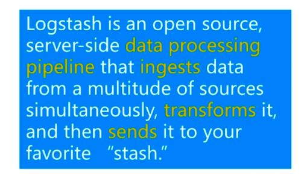

									# ElasticSearch

## 1 什么是ElasticSearch

​	基于Apache Luncene构建的开源搜索引擎

​	采用java编写 提供简单易用的ResufluAPI

​	轻松的横向扩展  可支持PB级别的结构化或非结构化数据处理

## 2 可用应用场景

​	海量数据分析引擎

​	站内搜索引擎

​	数据仓库

## 3 一线公司应用场景

​	英国卫报 --实时分析公众对文中的回应

​	维基百科 github-站内实时搜索

​	百度-实时日志监控平台

​	google  alibaba jd

## ES安装

参考

[es安装](https://satan12345.github.io/2019/01/21/es%E5%AE%89%E8%A3%85/)


../elasticsearch -d  后台启动es

## kibana安装


下载 kibana

解压 tar -zxvf kibana-5.6.9-linux-x86_64.tar.gz

ln -s kibana-5.6.9-linux-x86_64 kba

cd kba/config

修改配置文件


修改server.host为当前服务器的地址

修改elasticsearch.url为es实例的地址


./kibana &  后台启动kibaba

./elasticsearch -d

./kibaba &

### 集群配置 

主节点的配置文件中增加

要保证所有的节点的集群名称都保持一致

即：cluster.name: my-application

node.master: true

从节点的配置中要增加 发现主节点的的实例地址

discovery.zen.ping.unicast.hosts: ["192.168.119.158"]


## 基础概念

###集群和节点

一个集群是由一个或者多个es的节点组成


### 索引

索引是含有相同属性的文档集合

### 类型

索引可有定义一个或者多个类型 文档必须属于一个类型

### 文档

文档是可以被索引的基本数据单位

### 分片

每个索引都有多个分片 每个分片是一个lencene索引

### 备份

拷贝一份分片就是完成了分片的备份

默认5分分片 1个备份

分片只能在创建索引的时候确定 备份是可以动态修改的

## 基本用法

restful api

http://ip:port/索引/类型/文档id

//创建一个索引

```json

PUT /myindex
{
  "settings": {
    "number_of_shards": 5,
    "number_of_replicas": 1
  },
  "mappings": {
    "person":{
      "properties": {
        "name":{
          "type": "text"
        },
        "country":{
          "type": "keyword"
        },
        "age":{
          "type": "integer"
        },
        "date":{
          "type": "date",
          "format": "yyyy-MM-dd"
        }
      }
    }    
  }
}
```

### 数据插入

​	指定文档id插入

​	自动产生文档id插入

创建文档 指定id

```json
put myindex/person/1
{
  "name":"kakaxi",
  "age":18,
  "country":"muye",
  "date":"1989-08-03"
}

响应
{
  "_index": "myindex",
  "_type": "person",
  "_id": "1",
  "_version": 1,
  "result": "created",
  "_shards": {
    "total": 2,
    "successful": 2,
    "failed": 0
  },
  "created": true
}
```

创建文档 不指定id

```json
post /myindex/person
{
  "name":"mingren",
  "age":6,
  "country":"muye",
  "date":"1999-08-03"
}
```

### 修改文档数据

```json

PoST myindex/person/1/_update
{
  "doc":{
    "name":"万花筒卡卡西"
  }
}
响应
{
  "_index": "myindex",
  "_type": "person",
  "_id": "1",
  "_version": 2,
  "result": "updated",
  "_shards": {
    "total": 2,
    "successful": 2,
    "failed": 0
  }
}
```

```json
#脚本更新
POST myindex/person/1/_update
{
  "script": {
    "lang": "painless",
    "source": "ctx._source.age+=10"
  }
}

```

### 删除

​	删除文档

```json
DELETE myindex/person/1
响应：
{
  "found": true,
  "_index": "myindex",
  "_type": "person",
  "_id": "1",
  "_version": 5,
  "result": "deleted",
  "_shards": {
    "total": 2,
    "successful": 2,
    "failed": 0
  }
}
```

​	删除索引

```json
DELETE myindex 
响应
{
  "acknowledged": true
}
```

### 查询

数据准备

```json
//创建book索引
PUT /book
{
 "settings": {
   "number_of_shards": 5,
   "number_of_replicas": 1
 } ,
 "mappings": {
   "novel":{
     "properties": {
       "world_count":{
         "type": "integer"
       },
       "author":{
         "type": "keyword"
       },
       "title":{
         "type": "text"
       },
       "publish_date":{
         "type": "date",
         "format": "yyyy-MM-dd"
       }
     }
   }
 }
}
PUT /book/novel/5
{
  "author":"王五",
  "title":"菜谱",
  "world_count":5000,
  "publish_date":"2012-10-01"
}
PUT /book/novel/8
{
  "author":"瓦力",
  "title":"ElasticSearch入门",
  "world_count":3000,
  "publish_date":"2017-08-20"
}
PUT /book/novel/9
{
  "author":"很胖的瓦力",
  "title":"ElasticSearch精通",
  "world_count":3000,
  "publish_date":"2017-08-05"
}
PUT /book/novel/10
{
  "author":"牛魔王",
  "title":"芭蕉扇",
  "world_count":1000,
  "publish_date":"2000-10-01"
}
PUT /book/novel/2
{
  "author":"李三",
  "title":"Java入门",
  "world_count":2000,
  "publish_date":"2010-10-01"
}
PUT /book/novel/4
{
  "author":"李四",
  "title":"ElasticSearch大法好",
  "world_count":1000,
  "publish_date":"2017-08-01"
}
PUT /book/novel/6
{
  "author":"赵六",
  "title":"剑谱",
  "world_count":10000,
  "publish_date":"1997-01-01"
}
PUT /book/novel/1
{
  "author":"张三",
  "title":"移魂大法",
    "world_count":1000,
  "publish_date":"2000-01-01"
}
PUT /book/novel/7
{
  "author":"张三丰",
  "title":"太极拳",
  "world_count":1000,
  "publish_date":"1997-01-01"
}
PUT /book/novel/3
{
  "author":"张四",
  "title":"Python入门",
  "world_count":2000,
  "publish_date":"2005-10-01"
}
PUT /book/novel/11
{
  "author":"孙悟空",
  "title":"七十二变",
  "world_count":1000,
  "publish_date":"2000-10-01"
}
PUT /book/novel/12
{
  "author":"瓦力",
  "title":"瓦力教我们学ElasticSearch",
  "world_count":1000,
  "publish_date":"2017-08-01"
}

```


简单查询


```json
#根据id查询
GET /book/novel/1
#查询全部
GET book/novel/_search
{
  "query":{
    "match_all": {}
  }
}
#分页查询
GET book/novel/_search
{
  "query":{
    "match_all": {}
  },
  "from": 0,
  "size": 3
}

```

条件查询

```json
#条件查询
GET book/novel/_search
{
  "query": {
    "match": {
      "title": "ElasticSearch"
    }
  }
}
#增加排序条件
GET book/novel/_search
{
  "query": {
    "match": {
      "title": "ElasticSearch"
    }
  },
  "sort": [
    {
      "publish_date": {
        "order": "desc"
      }
    }
  ]
}

```


聚合查询

```json
#单个聚合
GET book/novel/_search
{
  "aggs": {
    "grou_by_world_count": {
      "terms": {
        "field": "world_count"
      }
    }
  }
}
#多个聚合
GET book/novel/_search
{
  "aggs": {
    "grou_by_world_count": {
      "terms": {
        "field": "world_count",
        "size": 10
      }
    },
    "group_by_publish_date":{
      "terms": {
        "field": "publish_date"
      }
    }
  }
}
#字段的统计聚合
GET book/novel/_search
{
  "aggs": {
    "grades_word_count": {
      "stats": {
        "field": "world_count"
      }
    }
  }
}
#响应
 "aggregations": {
    "grades_word_count": {
      "count": 10,
      "min": 1000,
      "max": 10000,
      "avg": 2700,
      "sum": 27000
    }
  }

#聚合查询字段最小值
GET book/novel/_search
{
  "aggs": {
    "min_world_count": {
      "min": {
        "field": "world_count"
      }
    }
  }
}
```

### 高级查询

子条件查询：特定字段查询 所指特定值

query content  

​	在查询的过程中 除了判断文档是否满足条件外 es还会计算一个_score来表示匹配的成都 旨在判断目标文档和查询条件匹配的有多好

全文本查询：针对文本类型数据

```json
#author类型为keyword 不可切分
GET book/novel/_search
{
  "query": {
    "match": {
      "author":"瓦力"
    }
  }
}
#title类型为text可以切分
GET book/novel/_search
{
  "query": {
    "match": {
      "title": "入门"
    }
  }
}

GET book/novel/_search
{
  "query": {
    "match": {
      "title": "ELasticSearch入门"
    }
  }
}
#短语匹配
GET book/novel/_search
{
  "query": {
    "match_phrase": {
      "title": "ELasticSearch入门"
    }
  }
}
#多个字段匹配查询
GET book/novel/_search
{
  "query": {
    "multi_match": {
      "query": "瓦力",
      "fields": ["title","author"]
    }
  }
}
#语法查询
GET book/novel/_search
{
  "query": {
    "query_string": {
     
      "query": "ElasticSearch and 大法"
    }
  }
}
GET book/novel/_search
{
  "query": {
    "query_string": {
     
      "query": "(ElasticSearch and 大法) or Python"
    }
  }
}

GET book/novel/_search
{
  "query": {
    "query_string": {
      "fields": ["author","title"], 
      "query": "瓦力 or ElasticSearch"
    }
  }
}
```


字段级别查询:针对结构化数据 如数字 日期等

```json
#字段查询
GET book/novel/_search
{
  "query": {
    "term": {
      "world_count": {
        "value": 1000
      }
    }
  }
}
#范围查询
GET book/novel/_search
{
  "query": {
    "range": {
      "world_count": {
        "gte": 1000,
        "lte": 2000
      }
    }
  }
}

GET book/novel/_search
{
  "query": {
    "range": {
      "publish_date": {
        "gte": "2010-09-12",
        "lte": "2017-09-12"
      }
    }
  }
}

GET book/novel/_search
{
  "query": {
    "range": {
      "publish_date": {
        "gte": "2010-09-12",
        "lte": "now"
      }
    }
  }
}
```


filter context

​	在判断查询过程中 只判断该文档是否满足条件 只有Yes或者No

```json
GET book/novel/_search
{
  "query": {
    "bool": {
      "filter": {
        "term": {
          "world_count": "1000"
        }
      }
    }
  }
}
```


符合条件查询：已一定的逻辑组合子条件查询

固定分数查询

```json
GET book/novel/_search
{
  "query": {
    "constant_score": {
      "filter": {
        "match":{
          "title":"elasticsearch"
        }
      },
      "boost": 1.2
    }
  }
}
```


bool查询

```json
GET book/novel/_search
{
  "query": {
    "bool": {
      "must": [
        {
          "match": {
            "author": "瓦力"
          }
        },
        {
          "match": {
            "title": "Elasticsearch"
          }
        }
      ]
    }
  }
}

GET book/novel/_search
{
  "query": {
    "bool": {
      "should": [
        {
          "match": {
            "author": "瓦力"
          }
        },
        {
          "match": {
            "title": "Elasticsearch"
          }
        }
      ]
    }
  }
}

GET book/novel/_search
{
  "query": {
    "bool": {
      "must": [
        {
          "match": {
            "author": "瓦力"
          }
        },
        {
          "match": {
            "title": "Elasticsearch"
          }
        }
      ],
      "filter": {
        "term": {
          "world_count": "1000"
        }
      }
    }
    
  }
}

```


###接口开发

* 新增图书开发功能 

* 新增图书修改功能

* 删除功能开发

* 综合功能和查询接口开发

  ​

mvn spring-boot:run

## ELastic Stack入门

> Elstic Stack产品简介
>
> ElasticSearch与Kibana入门
>
> Beats入门
>
> Logstash入门
>
> 实战：分析Elasticsearch查询语句
>
> 总结与建议

### Elasticsearch安装与运行

ElasticSearch配置说明

​	配置文件位于config目录中

	>elasticsearch.yml es的相关配置
	>
	>​	cluster.name 集群名称 一次作为是否是同一集群的判断条件
	>
	>​	node.name 节点名称 以此作为节点中不同节点的区分条件
	>
	>​	network.host/http.port 网络的地址和端口 用户http和transport服务使用
	>
	>​	path.data 数据存储地址
	>
	>​	path.log 日志存储地址
	>
	>Devlopment与Production模式说明
	>
	>​	以transport的地址是否绑定在localhost为判断标准 即network.host指定的是否为localhost
	>
	>​	Devlopment模式下载启动时会warning的方式提示配置检查异常
	>
	>​	Production模式下载启动时会以error的方式提示配置检查异常并退出
	>
	>​	参数修改的第二种方式
	>
	>​	bin/elasticsearch -Ehttp.port=19200
	>
	>
	>
	>
	>
	>
	>
	>jvm.options jvm的相关配置
	>
	>log4j2.properties 日志相关配置

### Elasticsearch 本地启动集群的方式

bin/elasticsearch 

bin/elasticsearch -Ehttp.port=8200 -Epath.data=node2

bin/elasticsearch -Ehttp.port=7200 -Epath.data=node3

查看集群节点信息

http://192.168.119.160:8200/_cat/nodes?v

查看集群状态

http://192.168.119.160:8200/_cluster/stats

### kibian安装与运行

下载kibana

​	https://www.elastic.co/cn/downloads/kibana

运行 

​	bin/kibana

​	修改config/kibana.yml 

​	elasticsearch.url

​	server.host 两个属性

### Kibana配置说明

​	配置位于config文件夹下 

​	Kibana.yml关键配置说明

server.host/server.port 访问kibana用的地址和端口

elasticsearch.url 待访问的elasticsearch的地址


### Kibana常用功能说明

- Discover数据搜索查看

- Visualize 图标制作

- Dashboard仪表盘

- Timelion 时序数据的高级可视化分享

- DevTools 开发者工具

- Management 配置管理

  ​

### Elasticsearch常用术语

​	Document 文档数据

​	Index 索引

​	Type 索引中的数据类型

​	Field 字段  文档的属性

​	Query DSL 查询语法

### ElasticSearchCRUD

```json
//插入文档
PUT /accounts/person/1
{
  "name":"jone",
  "lastname":"Doe",
  "job_description":"Systems administrator and Linxu specialit"
}
//读取文档
GET accounts/person/1
//更新文档
POST accounts/person/1/_update
{
  "doc": {
    "name":"kakaxi"
  }
}
//删除文档
DELETE accounts/person/1
```

### Elasticsearch Query

Query String 

GET accounts/person/_search?q=qimu

Query DSL

```json
GET accounts/person/_search
{
  "query": {
    "term": {
      "name": "kakaxi"
    }
  }
}
```

### Beats入门

#### 简介

​	Linghtweight Data Shipper

​		filebeat 日志文件

​		Metricbeat 数据度量

​		Packetbeat 网络数据

​		Winlogbeat windows 数据

​		Hearthbeat 健康检查

​	


Filebeat

​	处理流程

​	输入Input

​	处理Filter

​	输出Output

​	


Filebeat Input配置简介

​	yaml语法

​	Input_type

	>log
	>
	>stdin

​	


Filebeat OutPut配置简介

> Console
>
> Elasticsearch
>
> Logstash
>
> Kafka
>
> Redis
>
> File


head -n 2 /var/tmp/materials/nginx_logs|./filebeat -e -c nginx.yml 

### Packetbeat简介


./packetbeat -e -c es.yml -strict.perms=false

## Lohstash简介

Data Shipper

> ETL
>
> Extract
>
> Transform
>
> Load




## Elastic Stack从入门到放弃

ElasticSearch   ELK  大数据分析利器

ELK VS大数据

​	快

>使用门槛低  开发周期短  上线快
>
>性能好 查询库 实时展示结果
>
>扩容方便 快速支撑增长迅速的数据规模

ELK


> Search is something that any application should have


### 课程安排

​	

> elasticsearch篇
>
> beats篇
>
> Logstath篇
>
> Kibaba篇
>
> 实践篇

### ElasticSearch篇

> 什么是倒排索引  他的组成是什么
>
> 常见的相关性算分方法有哪些
>
> 为什么查询语句没有返回预期的文档
>
> 常用的数据类型有哪些 text和keyworld的区别是什么
>
> 集群是如何搭建起来的 是如何实现故障转移的
>
> Shard具体是由什么组成的

### 实践成果

​	搜索类项目

​	如何使用少量的代码即可搭建起一个相对完备的搜索类项目

​	慕课网日志分析

​	如何使用ElasticStack 快速的对nginx日志进行分析

​	空气质量分析

​	如何使用Elastic Stack快速分析手边的数据

### 说明

ElasticStack版本

​	6.1.1

### 学习建议

第一遍快速看完所有的视频 不求甚解

第二遍仔细看完视频 同时结合官方文档 力求掌握每个知识点

学会使用官方文档

遇到问题 多思考 善用搜索引擎 

### 常见术语

文档Document 

​	用户存在在es中的数据文档

索引 Index

​	由具有相同字段的文档列表组成

节点 Node

​	一个Elasticsearch 的运行实例 是集群的构成单元

集群 Cluster

​	由一个或多个节点组成 对外提供服务

### Document 

​	Json Object 由字段(Field)组成 常见数据类型如下

	>字符串 ：text(分词)  keyword（不分词）
	>
	>数值型： long integer short byte double float falf_float scaled_float
	>
	>布尔：boolean
	>
	>日期：date
	>
	>二进制:byte
	>
	>范围类型:integer_range float_range long_range  doubole_range date_range


### Document Meta

元数据 用于标注文档的相关信息

	>_index:文档所在的索引名
	>
	>_type:文档所在的类型名
	>
	>_id:文档唯一id 
	>
	>_uid:组合id  由 _type和_id组成(6.x  _type不在起作用 同_  _id)
	>
	>_source:文档的原始Json数据 可以从这里获取每个字段的内容
	>
	>_all:整合所有的字段内容到该字段 默认禁用

### Index

​	索引中存储具有相同结构的文档

​		每个索引都有自己的mapping定义 用于定义**字段名**和**类型**

一个集群可以有多个索引,比如 ：

​		nginx日志存储的时候可以按照日期每天生成一个索引来存储

### 创建索引与写入数据


​	

### 索引API

​	es有专门的Index API 用于创建 更新 删除索引等配置

​	创建

​	

```json
PUT /test_index
//响应
{
  "acknowledged": true,
  "shards_acknowledged": true,
  "index": "test_index"
}
//查看现有索引
GET /_cat/indices
//删除索引
DELETE test_index
```

### Document API

es有专门的Document API

创建文档

​	创建文档时 如果索引不存在 es会自动创建对应的index和type

```json
PUT test_index/doc/1
{
  "username":"kakxi",
  "age":1
}
//响应
{
  "_index": "test_index",
  "_type": "doc",
  "_id": "1",
  "_version": 1,
  "result": "created",
  "_shards": {
    "total": 2,
    "successful": 2,
    "failed": 0
  },
  "created": true
}
//不指定id创建文档api
POST test_index/doc
{
  "username":"mingren",
  "age":2
}
{
  "_index": "test_index",
  "_type": "doc",
  "_id": "AWiVVP7KsRTxe9RlB7ww",
  "_version": 1,
  "result": "created",
  "_shards": {
    "total": 2,
    "successful": 2,
    "failed": 0
  },
  "created": true
}
```


查询文档

```json
//request
GET test_index/doc/1
//response 存在数据 _source存储了文档的完整的原始文件数据
{
  "_index": "test_index",
  "_type": "doc",
  "_id": "1",
  "_version": 1,
  "found": true,
  "_source": {
    "username": "kakxi",
    "age": 1
  }
}
//response 404 NOTFOUND
{
  "_index": "test_index",
  "_type": "doc",
  "_id": "3",
  "found": false
}
//搜索所有的文档 用到_search
//request
GET test_index/doc/_search
//response
{
  "took": 39,
  "timed_out": false,
  "_shards": {
    "total": 5,
    "successful": 5,
    "skipped": 0,
    "failed": 0
  },
  "hits": {
    "total": 2,
    "max_score": 1,
    "hits": [
      {
        "_index": "test_index",
        "_type": "doc",
        "_id": "AWiVVP7KsRTxe9RlB7ww",
        "_score": 1,
        "_source": {
          "username": "mingren",
          "age": 2
        }
      },
      {
        "_index": "test_index",
        "_type": "doc",
        "_id": "1",
        "_score": 1,
        "_source": {
          "username": "kakxi",
          "age": 1
        }
      }
    ]
  }
}

GET test_index/doc/_search
{
  "query": {
    "term": {
      "_id": {
        "value": "1"
      }
    }
  }
}
```

批量创建文档API

es允许一次创建多个文档 从而减少网络传输开销 提升写入速率

endpoint为 _bulk


action_type:

​	index :创建文档 如果文档已经存在 则覆盖

​	update：更新

​	create:创建 如果文档已经存在 则报错

​	delete :删除文档

```json
POST _bulk
{"index":{"_index":"test_index","_type":"doc","_id":3}}
{"username":"you","age":4}
{"index":{"_index":"test_index","_type":"doc","_id":4}}
{"username":"zhishui","age":5}
```


批量查询文档API

​	es允许一次查询多个文档

​	endpoint为_mget如下

```json
GET /test_index/doc/_mget
{
  "docs":[
    {"_id":1},
    {"_id":3},
    {"_id":4}
    ]
}
```


更新文档

删除文档


正排索引

文档id到文档内容 单词的关联关系


倒排索引

​	单词到文档id的关联关系


倒排索引是搜索引擎的核心 主要包含两部分

​	单词词典(term Dictionary)

​	倒排列表(Posting List)

单词列表 是倒排索引的重要组成

​	记录所有文档的单词 一般都比较大

​	记录单词到倒排列表的关联信息

单词字典 的实现一般采用的是B+Tree

倒排列表(Posting List) 记录了单词对应的文档集合 鼬倒排索引项组成

倒排索引项（Posting） 主要包含了如下信息:

​	文档Id 用于获取原始信息

​	单词频率(TF term frequency) 记录该单词在该文档出现的次数 用于后续相关性算分

​	位置 (Position) 记录单词在文档中的分词位置(多个)用于做词语搜索

​	偏移(Offset) 记录单词在文档的开始和结束位置 用于做高亮显示


es存储的是一个json格式的文档 其中包含多个字段 每个字段都会有自己的倒排索引 


### 分词

​	分词是指将文本转换层一系列单词(term or token)的过程 也可以叫做文本分析 在es里面称为**Analysis**:如下图所示:

​	

分词器是es中专门处理分词的组件 英文为Analyzer 他的组成如下:

​	Character Filters:

​		针对元素文本进行处理 如何去除html特殊标记符

​	Tokenizer:

​		将元素文本按照一定规则切分为单词

​	Token Filters:

​		针对 Tokenizer处理的单词进行再加工 比如转小写 删除或者新增处理


