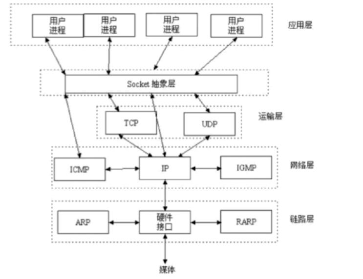

# 剑指Java面试-Offer直通车

## 网络知识考点

###OSI开放式互联参考模型

物理层  数据链路层  网络层 传输层（TCP UDP）  会话层   表示层  应用层（HTTP）

###TCP/IP

​	链路层  网络层  传输层(TCP UDP)  应用层

### Socket简介

socket是对tcp/ip协议的抽象 是操作系统对外开放的接口

Scoket通信流程

​	

### TCP的三次握手

## 关系型数据库主要考点

关系型数据库：架构  索引  锁  语法  理论范式

如何设计一个关系型数据库

程序实例：

​	存储管理   缓存机制  SQL解析 日志管理 权限划分	容灾机制	索引管理  锁管理 

存储模块（文件系统）

### 索引模块

​	常见问题：

​		为什么要使用索引？

​				快速查询数据

​				避免全表扫描

​		什么样的信息能称为索引

​			主键  唯一键  普通键

​		索引的数据结构

​			生成索引 建立二叉查找树进行二分查找

​			生成索引 建立B-Tree结构进行查找

​			生成索引 建立B+-Tree进行查找

​			生成索引 建立Hash结构进行查找

​		密集索引和稀疏索引的区别

### 二叉查找数据

二叉树节点只包含两个子节点

平衡二叉树：任意一个节点的左子树与右子树的高度差不超过1

二分查找

时间复杂度:O(logn)

影响呈现的性能在IO

**平衡二叉树 红黑树 每个节点最多有两个子节点 当数据块很多 数据量很大的时候 树的深度就会很深 进而导致IO次数很多 检索性能会很低**

检索深入每增加1 就增加一次IO

为了提高检索性能：

​	降低查询的时间复杂度

​	降低IO的次数

​	将树变的矮一些 将每个节点存储的数据多一些

### BTree

平衡多路查找树

每个索引块 包含关键字与每个孩子的指针

存储块包含的数据量与指针 取决于数据块的容量与数据库的相关配置

定义:

​	根节点至少包含两个孩子

​	树中每个节点最多含有m个孩子(m>=2) m取决于节点的容量与相关配置

​	除根节点和叶子节点外 其他每个节点至少含有ceilm/2)个孩子

​	所有叶子节点都位于同一层

​	

合并 分裂 上移 下移操作 来保证树BTree的特征

### B+-Tree

非叶子节点的子树指针与关键字个数相同

非叶子节点的子树指针P[i] 指向关键之值[K[i],K[i+1))的子树

非叶子节点 仅用来做索引 数据都保存在叶子节点中

所有叶子节点均有一个链指针指向下一个叶子节点（并按照大小顺序排序）（方便直接在叶子节点上做范围统计）

B +Tree的非叶子节点可以存储更多的关键字

B+Tree更适合用来做存储索引

​	B+Tree磁盘读写代价更低   非叶子节点只用来存储索引 不存放数据 一个节点可以存放更多的索引信息 所有数据都存储在叶子节点上

​	B+Tree查询效率更加稳定 由于内部节点并不是最终指向文件内容的节点 而只是叶子节点的关键字索引 任何数据查找必须走一条从根节点到叶子节点的路 所有关键字查询的路相同 导致每个数据查询的效率是相同的 

​	B+Tree更有利于对数据库的扫描 ：叶子节点存在指向下一个叶子节点的指针 所以对范围查询更加高效

根节点到非叶子节点 再到叶子节点

### HASH索引

​	

优点：查询效率高

缺点：

​	仅能满足 =  In 不能使用范围查询

​	无法被用来避免数据排序操作

​	不能利用部分索引查询

​	不能避免表扫描

​	遇到大量Hash值相等的情况后性能并一定就会比B-Tree索引高

### BitMap

​	位图索引

### 密集索引 和 稀疏索引的区别

密集索引文件中每个搜索码值都对应一个索引值

稀疏索引文件 职位索引码的某些值建立索引项

InnoDB  

​	若一个主键被定义 该主键则作为密集索引

​	若没有主键被定义 该表的第一个唯一非空索引则作为密集索引

​	若不满足以上条件 innodb内部会生成一个隐藏主键(密集索引)

​	非主键索引存储相关键位和起对应的主键值 包含两次查询

主键索引（密集索引） 将主键组织到一棵b+tree中 行数据就存储在叶子节点上 组件索引与数据是保存在同一个文件中的

非主键索引（稀疏索引）  在稀疏索引的b+Tree中检索该键 获取到主键信息 用组件再次进行一次b+tree 的检索操作 最终达到叶子节点获取整行数据

myism:

​	frm:存储表结构信息

​	myi：存储索引信息

​	myd:存储数据信息

innodb

​	frm:存储表结构信息

​        idb:存储索引+数据信息

如何定位并优化慢sql:

​	根据慢日志定位慢查询sql

​	使用explain等工具分析sql

id越大的越先被执行

type 

​	

extra

​	修改sql或者劲量让sql走索引

### 联合索引的最左匹配的原则的成因

最左前缀匹配原则  非常重要的原则 mysql会一直向右匹配直接遇到范围查询（> < btween like） 就停止匹配 比如a=3 and b=4 and c>5 and d=6 如果建立(a b c d)顺序的索引 d 是用不到索引的 如果建立(a b c d)的索引都是可以用到的 a b d的顺序可以任意调整

2 = 和 in 可以乱序 比如a=1 and b=2 and c=3 建立(a b c)索引可以任意顺序 mysql的查询优化器 会帮你优化成索引可以识别的形式

### 锁模块

myisam与innodb关于锁方面的区别是什么

myIsam默认使用的是表级锁  不支持行级别锁

表读锁（共享锁）

表写锁（排他锁）

Innodb默认用的是行级锁 也支持表级锁

按锁的粒度划分：可分为表级锁 行级锁 页级锁

按锁级别划分：可以分为共享锁 ，排他锁

按加锁方式划分：可以分为自动锁 显示锁

按照操作划分：可以分为DML 锁 DDL锁

按照使用方式 可以分为乐观锁 悲观锁

数据库事务的4大特性

事务隔离级别以及各级别下的并发访问问题

innodb可重复读隔离级别下如何避免幻读

RC RR级别下的Innodb的非阻塞读是如何实现的

### 数据库事务的四大特性

ACID

原子性 Atomic

一致性 Consistency

隔离性 Isolation

持久性 Durability

​	redo log保证日志文件的持久性

### 事务隔离级别一下各个级别一下的鬓发访问问题

事务并发访问引起的问题以及如何避免

​	更新丢失--mysql所有事务隔离级别在数据库层面上均可避免

​	脏读-- RU隔离级别存在的问题，Read-Committed事务隔离级别以上可以避免 

​	不可重复读--RC隔离级别存在的问题，Repeatable-read 事务隔离级别以上可以避免 

​	幻读--seriabizable 事务隔离级别可以避免

不可重复度侧重对同一数据的修改

幻读侧重于对数据新增/删除

## Java知识考点

### 平台无关性

### GC

### 语言特性

### 面向对象

### 类库

### 异常处理

编译时 

运行时

### 你了解java的内存模型么

​	元空间(MetaSpace)与永久代(PermGen)的区别

​		在java7中 原先位于方法区里的字符串常量池 被移动到了java堆中
​		java8中使用了元空间替代了永久代

​	元空间与永久代 均是方法区的实现

​	元空间使用本地内存 而永久代使用的jvm内存

###metaSpace相比PermGen的优势

​		字符串常量池在永久代中 容易出现性能问题和内存溢出

​		类和方法的信息大小难以确定 给永久代的大小指定带来困难

​		永久代会为GC带来不必要的复杂性

### Java堆（heap）

​	对象实例的分配区域

​		

