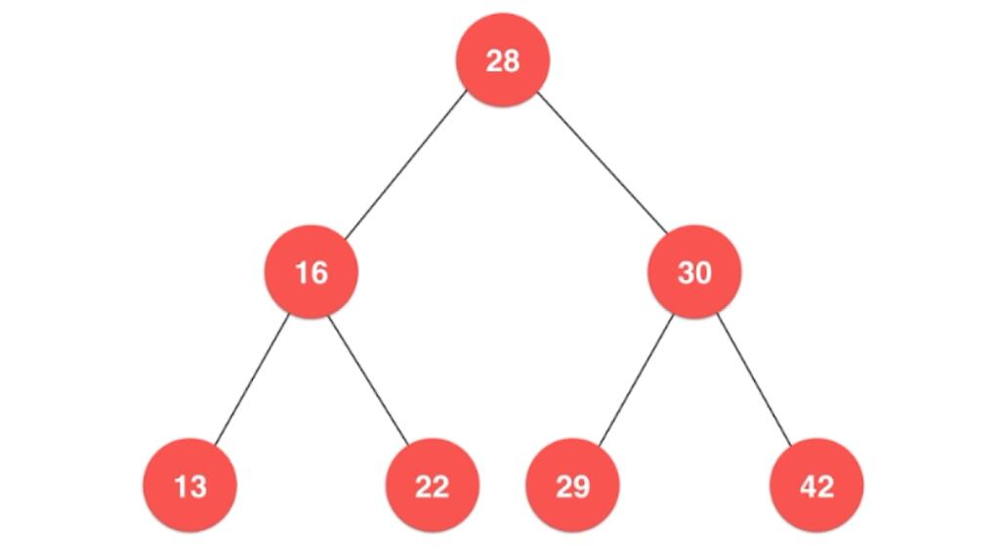
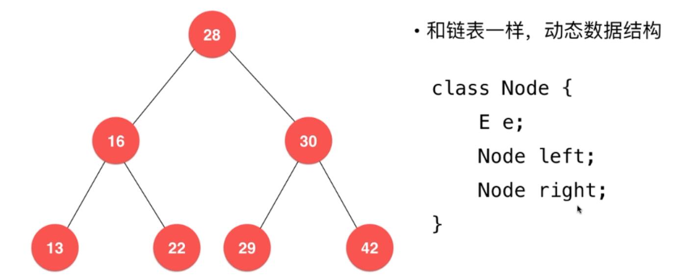
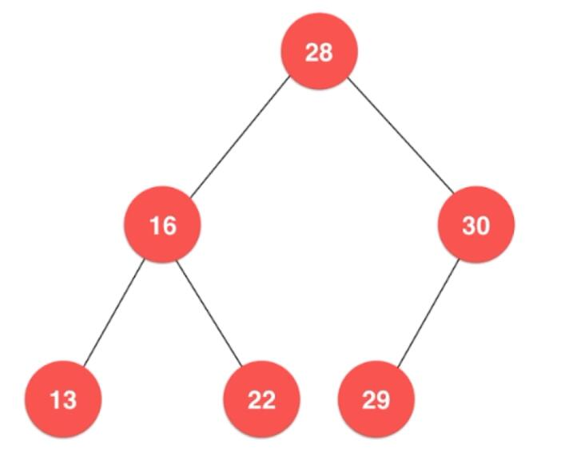
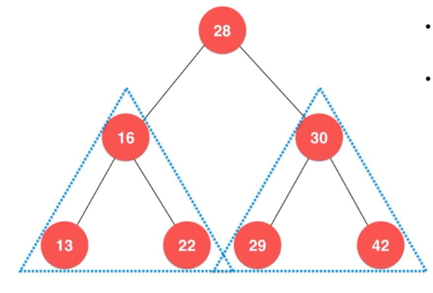

# 玩转数据结构


玩转算法面试

### 数组

 索引

数组最大优点：快速查询

数组最好应用于索引有语义的情况

size 实际装多少元素

capacity 容量（最多可以装多少元素）


O(n) 线性


栈是一种后进先出的数据结构

Last In First Out  (LIFO)


[leetCode](https://leetcode-cn.com/)

玩转算法面试 

leetcode题库分门别类详细解析


Stack

括号匹配 

系统栈的调用

undo操作

### Queue

​	队列也是一种线性结构

​	相比数组 队列对应的操作时数组的自己

​	只能从一端（队尾）添加元素 只能从另一端（对首）取出元素

​	

FIFO 先进先出

数组队列

### 链表与递归

递归：本质上 将原来的问题 转化为更小的同一问题


递归算法最基本操作：

​	求解最基本的问题

​	把原问题转化为更小的问题


### 树结构



为什么要有书结构?

​	高效

​	将数据使用树结构存储后 出奇的高效

二分搜索树

平衡二叉树：AVL   红黑树

堆：并查集

线段树：Trie(字典树 前缀树)


### 二分搜索树

二叉树




多叉数


二叉树具有唯一的根节点

```java
class Node{
  E el;
  Node left;//左孩子
  Node right;//右孩子
}
```

二叉树每个节点最多有两个孩子

一个孩子都没有的节点 通常称为叶子节点

二叉树每个节点最多有一个父亲


二叉树具有天然递归结构

​	每个节点的左子树也是二叉树

​	每个节点的右子树也是二叉树

二叉树不一定是满的



二分搜索树：

​	二分搜索树也是二叉树

​	二分搜索树的每一个节点的值：

​		大于其左子树节点的值

​		小于其右子树节点的值

​	每一棵子树也是二分搜索树




存储的元素必须有可比较性


### 集合

### 映射

### 平衡二叉树与AVL树

avl树

最早的自平衡二叉树

平衡二叉树

对于任意一个节点  左子树与右子树的高度不能超过1


