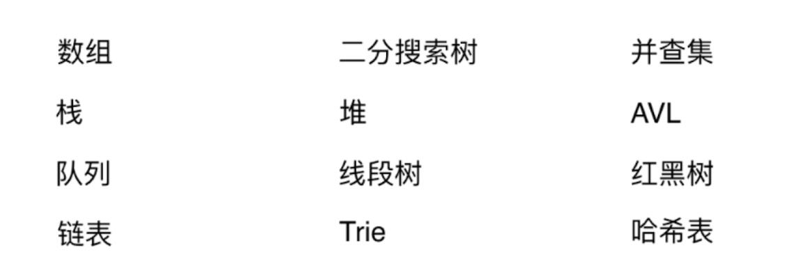
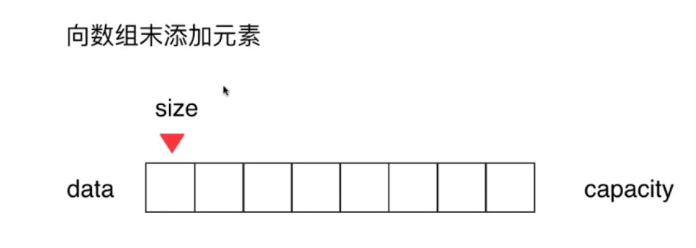
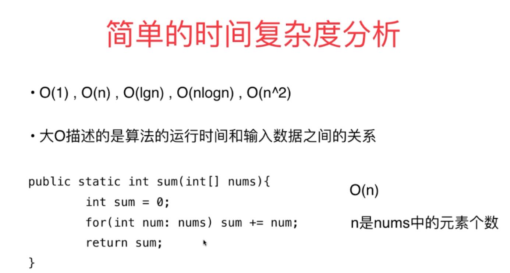
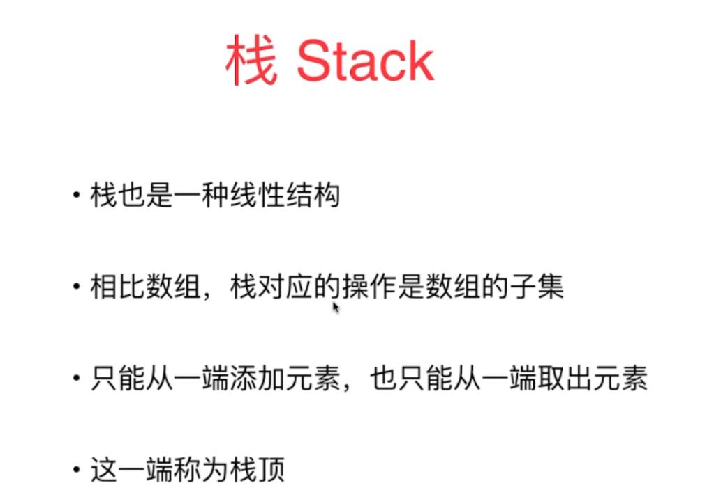
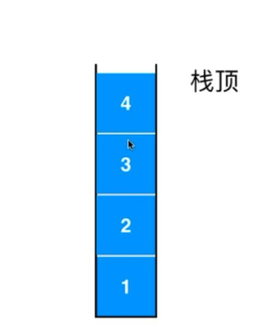
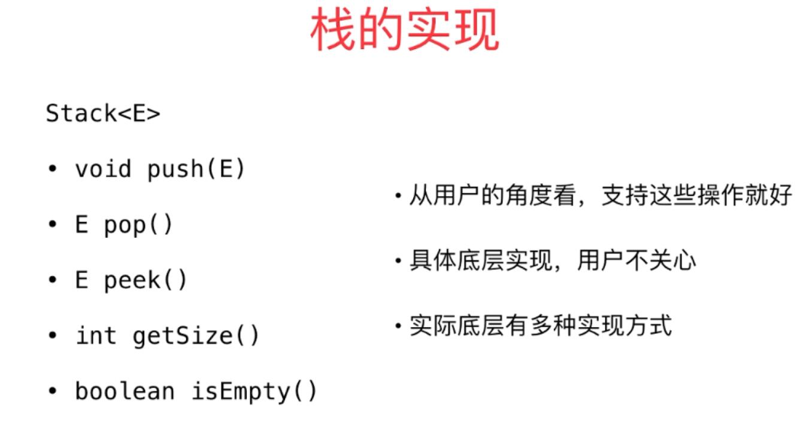
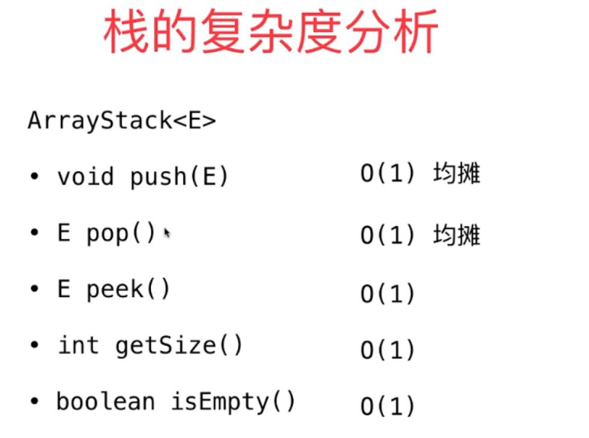
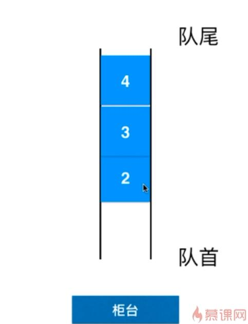
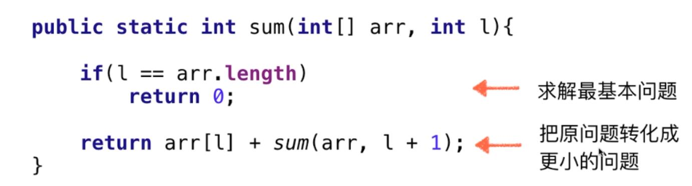

# 玩转数据结构

玩转算法面试

### 数组

 索引

数组最大优点：快速查询

数组最好应用于索引有语义的情况

size 实际装多少元素

capacity 容量（最多可以装多少元素）

O(n) 线性

栈是一种后进先出的数据结构

Last In First Out  (LIFO)

[leetCode](https://leetcode-cn.com/)

玩转算法面试 

leetcode题库分门别类详细解析

Stack

括号匹配 

系统栈的调用

undo操作

### Queue

​	队列也是一种线性结构

​	相比数组 队列对应的操作时数组的自己

​	只能从一端（队尾）添加元素 只能从另一端（对首）取出元素

​	

FIFO 先进先出

数组队列

### 链表与递归

递归：本质上 将原来的问题 转化为更小的同一问题

递归算法最基本操作：

​	求解最基本的问题

​	把原问题转化为更小的问题