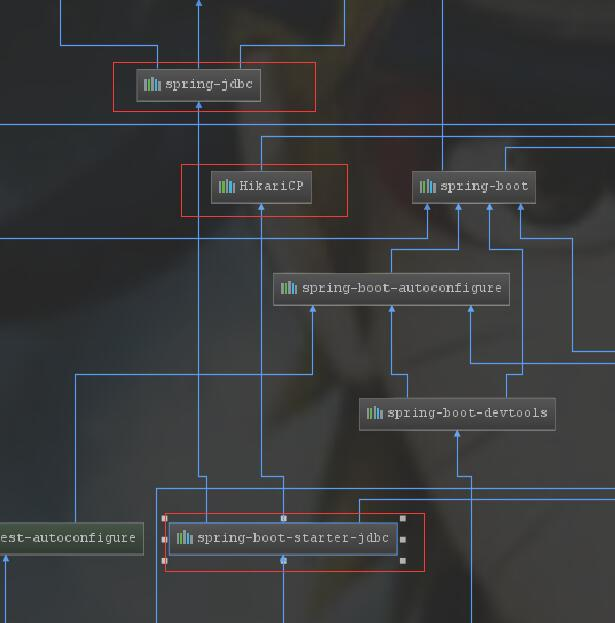

# 第 3-1 课：Spring Boot 使用 JDBC 操作数据库

> 《精通 Spring Boot 42 讲》共分五大部分，第三部分主要讲解 Spring Boot 和数据库开发，共 8 课。Spring Boot 支持了主流的 ORM 框架：MyBatis、Hibernate 和 Spring JDBC，几种 ORM 在不同的场景下各有优势，在 Spring Boot 体系内都有对应的 Starter 包以方便集成。首先将讲解 Spring JDBC 的使用，然后介绍 MyBatis 和 JPA 的各种使用场景以及多数据源的使用，接着演示如何集成流行的数据库连接池 Druid，最后结合本课程第二部分内容综合实践 JPA 和 Thymeleaf 的使用。

JDBC（Java Data Base Connectivity，Java 数据库连接）是一种用于执行 SQL 语句的 Java API，可以为多种关系数据库提供统一访问，它由一组用 Java 语言编写的类和接口组成。JDBC 提供了一种基准，据此可以构建更高级的工具和接口，使数据库开发人员能够编写数据库应用程序。

说白了 JDBC 就是一套 Java 访问数据库的 API 规范，利用这套规范屏蔽了各种数据库 API 调用的差异性。当 Java 程序需要访问数据库时，直接调用 JDBC API 相关代码进行操作，JDBC 调用各类数据库的驱动包进行交互，最后数据库驱动包和对应的数据库通讯，完成 Java 程序操作数据库。

直接在 Java 程序中使用 JDBC 比较复杂，需要 7 步才能完成数据库的操作：

- 加载数据库驱动
- 建立数据库连接
- 创建数据库操作对象
- 定义操作的 SQL 语句
- 执行数据库操作
- 获取并操作结果集
- 关闭对象，回收资源

关键代码如下：

```java
try {
    // 1、加载数据库驱动
    Class.forName(driver);
    // 2、获取数据库连接
    conn = DriverManager.getConnection(url, username, password);
    // 3、获取数据库操作对象
    stmt = conn.createStatement();
    // 4、定义操作的 SQL 语句
    String sql = "select * from user where id = 6";
    // 5、执行数据库操作
    rs = stmt.executeQuery(sql);
    // 6、获取并操作结果集
    while (rs.next()) {
    // 解析结果集
    }
} catch (Exception e) {
    // 日志信息
} finally {
    // 7、关闭资源
}
```

通过上面的示例可以看出直接使用 JDBC 来操作数据库比较复杂，因此后期在 JDBC 的基础上又发展出了很多著名的 ORM 框架，其中最为流行的是 Hibernate、MyBatis 和 Spring JDBC。这三个流行的 ORM 框架在后续的课程中都会讲到，这里主要了解一下 Spring JDBC 在 Spring Boot 中的使用。

Spring Boot 针对 JDBC 的使用提供了对应的 Starter 包：spring-boot-starter-jdbc，它其实就是在 Spring JDBC 上做了进一步的封装，方便在 Spring Boot 生态中更好的使用 JDBC，下面进行示例演示。

### 快速上手

Spring Boot 集成 JDBC 很简单，需要引入依赖并做基础配置即可，在开发项目之前需要先创建表，作为项目演示使用。设计一个 User 用户表，有 id、name、password、age 等字段，对应的 SQL 脚本如下：

```sql
DROP TABLE IF EXISTS `users`;
CREATE TABLE `users` (
  `id` bigint(20) NOT NULL AUTO_INCREMENT COMMENT '主键id',
  `name` varchar(32) DEFAULT NULL COMMENT '用户名',
  `password` varchar(32) DEFAULT NULL COMMENT '密码',
  `age`  int DEFAULT NULL,
  PRIMARY KEY (`id`)
) ENGINE=InnoDB AUTO_INCREMENT=1 DEFAULT CHARSET=utf8;
```

#### 添加配置

添加依赖包：

```xml
<dependency>
    <groupId>org.springframework.boot</groupId>
    <artifactId>spring-boot-starter-jdbc</artifactId>
</dependency>
<dependency>
    <groupId>mysql</groupId>
    <artifactId>mysql-connector-java</artifactId>
</dependency>
```

演示项目中使用 MySQL 作为数据库，因此项目中需要引入 MySQL 驱动包，同时引入 spring-boot-starter-jdbc。打开 pom.xml 文件，按下快捷键：Ctrl + Alt + SHIFT + U，或者单击右键，选择 Diagrams | Show Dependencies 选项，查看项目依赖类图。



- HikariCP 是 Spring Boot 2.0 默认使用的数据库连接池，也是传说中最快的数据库连接池。

- spring-jdbc 是 Spring 封装对 JDBC 操作的工具包。

  ​

数据源配置：

```properties
spring.datasource.url=jdbc:mysql://localhost:3306/test?serverTimezone=UTC&useUnicode=true&characterEncoding=utf-8&useSSL=true
spring.datasource.username=root
spring.datasource.password=root
spring.datasource.driver-class-name=com.mysql.cj.jdbc.Driver
```

> 值得注意的是，在 Spring Boot 2.1.0 中，com.mysql.jdbc.Driver 已经过期，推荐使用 com.mysql.cj.jdbc.Driver。

#### 实体类

创建表对应的实体类：

```java
@Data
@NoArgsConstructor
@AllArgsConstructor
public class User {
    private Long id;
    private String name;
    private String password;
    private int age;
}
```

实体类的数据类型要和数据库字段一一对应：

- Long 对应 bigint

- String 对应 varchar

- int 对应 int

  ​

#### 封装 Repository

创建 UserRepository 定义我们常用的增删改查接口：

```java
public interface UserRepository  {
    int save(User user);
    int update(User user);
    int delete(long id);
    List<User> findALL();
    User findById(long id);
}
```

创建 UserRepositoryImpl 类实现 UserRepository 类接口：

```java
  @Autowired
    JdbcTemplate primaryJdbcTemplate;
    @Override
    public int save(User user) {
		//通过以上代码可以看出，其实就是拼接数据库插入的 SQL，作为参数传给 update 方法。
        return primaryJdbcTemplate.update("insert into users(id, name, password, age) value (?,?,?,?)",
                user.getId(),user.getName(),user.getPassword(),user.getAge());
    }

    @Override
    public int update(User user) {
        return primaryJdbcTemplate.update("update users set name=?,password=?,age=? where id=?",
                user.getName(),user.getPassword(),user.getAge(),user.getId());
    }

    @Override
    public int delete(long id) {
        return primaryJdbcTemplate.update("delete from users where id=?",id);
    }

    @Override
    public List<User> findALL() {
        return primaryJdbcTemplate.query("select * from users", (resultSet, i) -> {
            User user=new User();
            user.setId(resultSet.getLong("id"));
            user.setAge(resultSet.getInt("age"));
            user.setName(resultSet.getString("name"));
            user.setPassword(resultSet.getString("password"));
            return user;
        });
    }
//这里使用了 new BeanPropertyRowMapper<User>(User.class) 对返回的数据进行封装，它可自动将一行数据映射到指定类的实例中，首先将这个类实例化，然后通过名称匹配的方式，映射到属性中去。
    @Override
    public User findById(long id) {
        return primaryJdbcTemplate.queryForObject("select * from users where id=?", new Object[]{id}, (resultSet, i) -> {
            User user=new User();
            user.setId(resultSet.getLong("id"));
            user.setAge(resultSet.getInt("age"));
            user.setName(resultSet.getString("name"));
            user.setPassword(resultSet.getString("password"));
            return user;
        });

    }
```

#### 测试

```java
@RunWith(SpringRunner.class)
@SpringBootTest
@Slf4j
public class UserRepositoryTest {

    @Autowired
    UserRepository userRepository;

    @Autowired
    JdbcTemplate primaryJdbcTemplate;

    @Autowired
    JdbcTemplate secondaryJdbcTemplate;
	//测试保存
    @Test
    public void testSave(){
        User user=new User(2L,"宇智波鼬","333333",7);
        int affectCount = userRepository.save(user);
        log.info("保存影响的行数为:{}",affectCount);
    }
	//测试查询所有
    @Test
    public void testFindAll(){
        List<User> all = userRepository.findALL();
        log.info("查询到的列表数据为:{}",all);
    }
  	//测试根据id查询
    @Test
    public void testQueryById(){
        User user = userRepository.findById(2L);
        log.info("查询到的用户信息为:{}",user);
    }
  	//测试更新
    @Test
    public void testUpdate(){
        User user = userRepository.findById(2L);
        user.setPassword("23456");
        int affectCount = userRepository.update(user);
        log.info("影响的数据条数为:{}",affectCount);
    }
	//测试删除
    @Test
    public void testDelete(){
        int affectCount = userRepository.delete(3L);
        log.info("影响的数据条数为:{}",affectCount);
    }
	//多个数据源测试
    @Test
    public void test(){
        String sql="select  count(*) as num from users";
        List<Integer> pCount = primaryJdbcTemplate.query(sql, new RowMapper<Integer>() {
            @Override
            public Integer mapRow(ResultSet rs, int rowNum) throws SQLException {
                return rs.getInt("num");
            }
        });
        log.info("pCount={}",pCount);
        List<Integer> sCount = secondaryJdbcTemplate.query(sql, new RowMapper<Integer>() {
            @Override
            public Integer mapRow(ResultSet rs, int rowNum) throws SQLException {
                return rs.getInt("num");
            }
        });
        log.info("sCount={}",sCount);
    }

}
```

### 多数据源的使用

在项目中使用多个数据源是很常见的情况，Spring Boot 中多数据源的使用需要自行封装。我们在上面示例项目的基础上进行改造。

#### 配置文件

```properties
spring.datasource.primary.jdbc-url=jdbc:mysql://localhost:3306/test1?serverTimezone=UTC&useUnicode=true&characterEncoding=utf-8&useSSL=true
spring.datasource.primary.username=root
spring.datasource.primary.password=root
spring.datasource.primary.driver-class-name=com.mysql.cj.jdbc.Driver

spring.datasource.secondary.jdbc-url=jdbc:mysql://localhost:3306/test2?serverTimezone=UTC&useUnicode=true&characterEncoding=utf-8&useSSL=true
spring.datasource.secondary.username=root
spring.datasource.secondary.password=root
spring.datasource.secondary.driver-class-name=com.mysql.cj.jdbc.Driver

```

添加了两个数据源，一个是 test1 库，一个是 test2 库。

> 注意，这里使用的是 spring.datasource.*.jdbc-url，因为默认连接池 HikariCP 读取的是 jdbc-url。

#### 初始化 JDBC

在项目启动的时候读取配置文件中的信息，并对 JDBC 初始化。

```java
@Configuration
public class DataSourceConfig {
    @Primary
    @Bean(name = "primaryDataSource")
    @Qualifier("primaryDataSource")
    @ConfigurationProperties(prefix="spring.datasource.primary")
    public DataSource primaryDataSource() {
            return DataSourceBuilder.create().build();
    }

    @Bean(name = "secondaryDataSource")
    @Qualifier("secondaryDataSource")
    @ConfigurationProperties(prefix="spring.datasource.secondary")
    public DataSource secondaryDataSource() {
        return DataSourceBuilder.create().build();      
    }

    @Bean(name="primaryJdbcTemplate")
    public JdbcTemplate primaryJdbcTemplate (
        @Qualifier("primaryDataSource")  DataSource dataSource ) {
        return new JdbcTemplate(dataSource);
    }

    @Bean(name="secondaryJdbcTemplate")
    public JdbcTemplate  secondaryJdbcTemplate(
            @Qualifier("secondaryDataSource") DataSource dataSource) {
        return new JdbcTemplate(dataSource);
    }
}

```

这段代码表示在启动的时候根据特定的前缀加载不同的数据源，根据构建好的数据源再创建不同的 JDBC。

#### UserRepository 改造

我们对 UserRepository 中的所有方法进行改造，增加一个参数为 JdbcTemplate，如果方法中传输了 JdbcTemplate，方法内就会使用传递的 JdbcTemplate 进行操作，如果传递的 JdbcTemplate 为空，使用默认的 JdbcTemplate 连接操作。

```
@Repository
public class UserRepositoryImpl implements UserRepository {
    @Autowired
    private JdbcTemplate primaryJdbcTemplate;

    @Override
    public int save(User user,JdbcTemplate jdbcTemplate) {
        if(jdbcTemplate == null){
            jdbcTemplate= primaryJdbcTemplate;
        }
        return jdbcTemplate.update("INSERT INTO users(name, password, age) values(?, ?, ?)",
              user.getName(), user.getPassword(), user.getAge());
    }

  //其他方法省略，详细内容可以查看源码
}

```

#### 多数据源测试

测试类中注入了两个不同数据源的 JdbcTemplate，同时注入 UserRepository。测试使用不同的 JdbcTemplate 插入两条数据，查看两个数据库中是否都保存成功。

```
@RunWith(SpringRunner.class)
@SpringBootTest
public class UserRepositoryTests {
    @Autowired
    private UserRepository userRepository;
    @Autowired
    private JdbcTemplate primaryJdbcTemplate;
    @Autowired
    private JdbcTemplate secondaryJdbcTemplate;

    @Test
    public void testSave() {
        User user =new User("smile","123456",30);
        userRepository.save(user,primaryJdbcTemplate);
        userRepository.save(user,secondaryJdbcTemplate);
    }
}

```

> 测试前请先创建 test1 和 test2 数据库，以及两个数据库中的用户表。

执行 testSave() 成功后，登录 test1 和 test 2 数据库查看 user 表，都存在一条 name 为 smile 的用户信息，说明多数据源插入数据成功，其他方法的测试大体相同。这样在项目中，我们想使用哪个数据源操作数据库时，只需要传入数据源对应的 JdbcTemplate 实例即可。

### 总结

通过本节课程的学习，了解到使用原生的 JDBC 操作数据库非常繁琐，需要开发者自行封装数据库连接，执行完成后手动关闭对应的资源，这样不利于统一规范，也容易出现问题。后期 Spring 针对 JDBC 的使用推出了 Spring JDBC，Spring Boot 在此基础上又进行了一步封装，如今在 Spring Boot 项目中 JDBC 操作数据库非常简单。